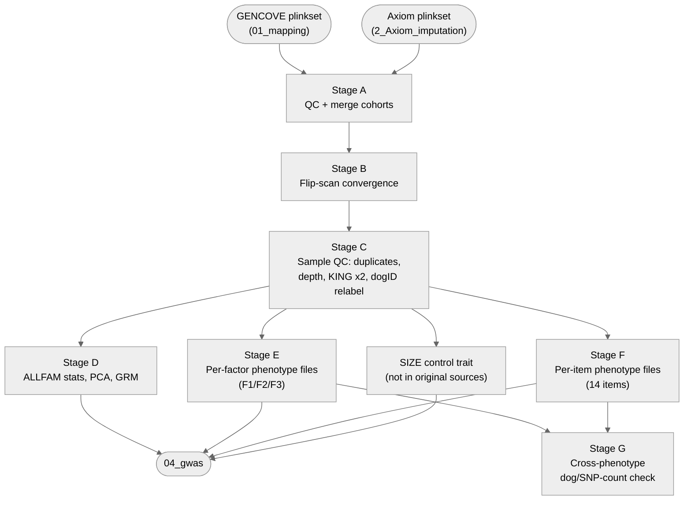

# 02. Data processing — 3. Merging & filtering

Merges the LowPass GENCOVE genotypes ([`01_mapping`](../../01_mapping)) and Axiom array
genotypes ([`2_Axiom_imputation`](../2_Axiom_imputation)), filters samples and variants through
several QC rounds, and produces per-phenotype (3 survey factors + 14 survey items + the SIZE
control trait) GWAS-ready PLINK datasets consumed by [`04_gwas`](../../04_gwas).

**Pipeline engine:** Nextflow
**Containerized:** Yes (Seqera Wave)
**Estimated runtime:** [FILL IN]

---

## Pipeline Overview

Implements 7 stages (A–G) from the original combined script
(`01_gencove_axiom_merging_filtering.sh`, `02_create_ALLFAM_check_stats.sh`,
`03_create_files_per_factor_mlma.R`, `04_create_files_per_item_polmm.R`):

`FILTER_DATA6_TO_QC5` (part of Stage E) restricts+reorders the frozen `data6` checkpoint (3328
rows, untouched by Stage C's LowPass-12 fix) to QC5's own 3316-dog set/order before Stages E/F
consume it — see that process's own header comment for why this ordering matters ahead of the
positional `--fam` substitution in `FILTER_FACTOR_QC6`/`FILTER_ITEM_QC6`.

---

## Input Data

No samplesheet — inputs are direct file params (see
[`nextflow_schema.json`](nextflow_schema.json)).

| Parameter | File | Source |
|-----------|------|--------|
| `gencove_bfile_prefix` | `DA_IMP_GENCOVE_ALLCHR.{bed,bim,fam}` | [`01_mapping/2_cohort_genotyping`](../../01_mapping/2_cohort_genotyping) output |
| `axiom_bfile_prefix` | `DA_AFFYimp_ALLCHR.{bed,bim,fam}` | [`2_Axiom_imputation`](../2_Axiom_imputation) output |
| `fam_qc3modi` | `DA_MERGED_GENCOVE_AXIOM_QC3modi.fam` | [`data/02_data_processing/`](../../../data/02_data_processing) — frozen checkpoint |
| `depth_file` | `DarwinsDogs_N-3285_bam_meandepths.txt` | [`data/02_data_processing/`](../../../data/02_data_processing) |
| `duplicates_file` | `Duplicates_to_keep_DarwinsDogs_N-9_21samples_bam_meandepths.txt` | [`data/02_data_processing/`](../../../data/02_data_processing) |
| `exclude_list_round2` | `list_exclude_secondexclusion.txt` | [`data/02_data_processing/`](../../../data/02_data_processing) |
| `dogid_relabel_fam` | `modi_DA_MERGED_GENCOVE_AXIOM_QC4C_forDogIDchange.fam` | [`data/02_data_processing/`](../../../data/02_data_processing) |
| `exclude_list_round3` | `list_exclude_thirdexclusion.txt` | [`data/02_data_processing/`](../../../data/02_data_processing) |
| `covariates` | `DarwinsDogs_Q121_height_age_sex_batch_GENCOVE_AXIOM_QC4.tsv` | [`data/02_data_processing/`](../../../data/02_data_processing) |
| `fam_2584dogs` | `fam_2584dogs.txt` | [`data/02_data_processing/`](../../../data/02_data_processing) |
| `data6` | `data6_2024-10-14.txt` | [`data/02_data_processing/`](../../../data/02_data_processing) — frozen checkpoint, 3328 rows |
| `exclude_list_lowpass12` | `exclude_12_LowPass_samples.txt` | [`data/01_mapping/`](../../../data/01_mapping) — **not part of the original script sources**, see `APPLY_EXCLUDE_LOWPASS12`'s header comment |
| `size_pheno_file` | `Q121A.pheno` | [`data/02_data_processing/`](../../../data/02_data_processing) — **not part of the original 01/02/03/04 sources**, see `process_definitions.nf`'s SIZE section header |

---

## Output Data

Published under `outputDir` (`data/results/02_data_processing/3_Merging_filtering`, symlinked
by default):

| Path | Description |
|------|-------------|
| `plink/` | Every stage's PLINK dataset — merged QC3/QC5, ALLFAM QC6 + PCA, per-factor/per-item/SIZE QC6, item eigeninput |
| `phenotypes/` | `data1` covariate table, per-factor/per-item/SIZE `.phen`/`.qcovar`/`.covar` files, item GRAB files |
| `population_structure/` | ALLFAM PCA eigenvectors/eigenvalues |
| `grm/` | ALLFAM genetic relatedness matrix (`.grm.bin`/`.grm.N.bin`/`.grm.id`) |
| `diagnostics/` | Flip-scan, exclusion, KING (x2), depth-histogram, per-phenotype, and cross-phenotype-count logs/plots |

---

## Process Map

31 processes across 7 stages (+ SIZE, not in the original sources):

| Stage | Processes |
|---|---|
| A — QC + merge | `QC_FILTER_GENCOVE`, `QC_FILTER_AXIOM`, `MERGE_DIAGNOSTIC`, `MERGE_COHORTS`, `QC_MERGED` |
| B — Flip-scan convergence | `FLIP_SCAN_CONVERGENCE` |
| C — Sample QC | `QC_FINAL_MERGE`, `BUILD_EXCLUDE_LIST_ROUND1`, `APPLY_EXCLUDE_ROUND1`, `PRUNE_FOR_KING`, `PCA_ROUND1`, `RUN_KING_ROUND1`, `APPLY_EXCLUDE_ROUND2`, `PCA_ROUND2`, `RUN_KING_ROUND2`, `APPLY_EXCLUDE_LOWPASS12`, `FILTER_DOGID_RELABEL_FAM`, `RELABEL_AND_EXCLUDE_ROUND3`, `BUILD_DATA1` |
| D — ALLFAM stats/PCA/GRM | `BUILD_ALLFAM_QC6`, `PRUNE_ALLFAM`, `PCA_ALLFAM`, `BUILD_GRM`, `DEPTH_HISTOGRAMS` |
| SIZE — control trait | `BUILD_SIZE_FAM`, `FILTER_SIZE_QC6`, `BUILD_SIZE_COVARIATES` |
| E — Per-factor (F1/F2/F3) | `FILTER_DATA6_TO_QC5`, `BUILD_FACTOR_FAM`, `FILTER_FACTOR_QC6`, `BUILD_FACTOR_COVARIATES` |
| F — Per-item (14 items) | `BUILD_ITEM_FAM`, `FILTER_ITEM_QC6`, `PRUNE_ITEM_LD`, `BUILD_ITEM_EIGENINPUT`, `BUILD_ITEM_GRAB` |
| G — Cross-phenotype check | `CHECK_PHENOTYPE_COUNTS` (barrier over all 17 factor+item QC6 datasets) |

---

## Notes

- `APPLY_EXCLUDE_LOWPASS12`/`FILTER_DOGID_RELABEL_FAM` are **not part of the original script** —
  `01_gencove_axiom_merging_filtering.sh` never actually removes 12 LowPass samples it should
  have, so QC5 here is shrunk to 3316 dogs (see each process's own header comment).
- The `SIZE` control-trait processes (`BUILD_SIZE_FAM`, `FILTER_SIZE_QC6`,
  `BUILD_SIZE_COVARIATES`) are **not part of the original 01/02/03/04 sources** — added so the
  body-size control trait runs through the same MLMA-LOCO GWAS path as F1/F2/F3 in `04_gwas`
  (see `process_definitions.nf`'s SIZE section header).
- Stage E's `data6` frozen checkpoint is a stand-in for recomputing per-item response data from
  `data1` + the per-factor `CCD3F.txt` files — kept as a frozen input rather than recomputed here.
- Two independent per-item channels (`item_qc6_out.plink`, `item_prune_out.prune_in`) must be
  explicitly joined by `item_id` before `BUILD_ITEM_EIGENINPUT` — passing them as two separate
  process inputs would pair rows by arrival order, not identity.

---

## Container

Two Seqera Wave containers: `plink` (bare PLINK 1.90, used by every pure-PLINK step — the
majority of processes) and `merging_filtering_tools` (broader toolset — GCTA, KING, R — for the
GRM, KING, and R-based diagnostic/covariate-building steps). See each process's own `container`
directive in `process_definitions.nf` for exact assignment.
