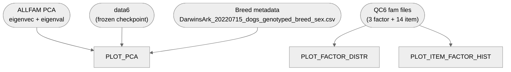

# 02. Data processing — 4. Plotting

Terminal, diagnostic-only plots over [`3_Merging_filtering`](../3_Merging_filtering)'s outputs:
PCA colored by breed, factor-score distributions, and per-item/per-factor response histograms.
Nothing here feeds any further stage.

**Pipeline engine:** Nextflow
**Containerized:** Yes (Seqera Wave — reuses `3_Merging_filtering`'s container)
**Estimated runtime:** [FILL IN]

---

## Pipeline Overview

---

## Input Data

No samplesheet — inputs are direct file/directory params (see
[`nextflow_schema.json`](nextflow_schema.json)).

| Parameter | File | Source |
|-----------|------|--------|
| `eigenvec` | `prunedALLFAM_DA_MERGED_GENCOVE_AXIOM_QC6.eigenvec` | `3_Merging_filtering`'s `allfam_eigenvec` output |
| `eigenval` | `prunedALLFAM_DA_MERGED_GENCOVE_AXIOM_QC6.eigenval` | `3_Merging_filtering`'s `allfam_eigenval` output |
| `data6` | `data6_2024-10-14.txt` | [`data/02_data_processing/data6_2024-10-14.txt`](../../../data/02_data_processing/data6_2024-10-14.txt) — same frozen checkpoint `3_Merging_filtering` consumes |
| `dog_breeds_csv` | `DarwinsArk_20220715_dogs_genotyped_breed_sex.csv` | Download from [doi.org/10.17044/scilifelab.33339309](https://doi.org/10.17044/scilifelab.33339309) into `data/02_data_processing/` |
| `qc6_fam_dir` | (directory) | `3_Merging_filtering`'s published `plink/` output directory — must contain `CCDF{1,2,3}_DA_MERGED_GENCOVE_AXIOM_QC6.fam` and all 14 `CCDitem{N}_DA_MERGED_GENCOVE_AXIOM_QC6.fam` files |

---

## Output Data

| Path | Description |
|------|-------------|
| `diagnostics/pca_diagnostics.log` | PCA/breed-join diagnostic prints (head/nrow/table calls) |
| `plots/pca_by_breed.png` | PCA1 vs. PCA2, colored/shaped by breed and purebred status |
| `diagnostics/factor_distr_diagnostics.log` | Per-factor score/SD ratio diagnostics |
| `plots/factor_distr.png` | F1/F2/F3 factor-score histograms, stacked vertically |
| `diagnostics/item_factor_hist_diagnostics.log` | Factor-score and item-response diagnostic prints |
| `plots/factor_hist_row.png` | F1+F2+F3 factor-score histograms, side by side |
| `plots/item_hist_row_f1.png` | CCDF1's 4 item-response histograms (item7/153/154/155), side by side |
| `plots/item_hist_row_f2.png` | CCDF2's 3 item-response histograms (item93/95/150), side by side |
| `plots/item_hist_row_f3.png` | CCDF3's 7 item-response histograms (item145/146/147/148/149/151/152), side by side |

---

## Process Map

| # | Process | Description |
|---|---------|-------------|
| 1 | `PLOT_PCA` | PCA scatter plots colored/shaped by breed |
| 2 | `PLOT_FACTOR_DISTR` | F1/F2/F3 factor-score distribution histograms, stacked vertically |
| 3 | `PLOT_ITEM_FACTOR_HIST` | Factor-score histogram row + 3 per-item response histogram rows |

---

## Notes

- Diagnostic prints and plots are captured as real output files (`png(...)`/`dev.off()`, text
  diagnostics inside a `sink(log_file, split = TRUE)` block) rather than left to an interactive
  session.
- `plot_factor_distr.R` and `plot_item_factor_hist.R` build their 3 and 17 plots respectively from
  small per-plot config tables (one row per plot); every functional/styling difference between
  plots (title, axis label, color, x-axis breaks/limits, margins, axis hjust, whether the y-axis is
  blanked) is preserved exactly per plot, including one source oddity kept as-is: item152 has no
  `scale_x_continuous(breaks=1:6)` call unlike its 6 CCDF3 siblings.
- PCA's axis-label variance percentages, every `N=` annotation, and the shared axis ranges for the
  continuous factor-score histograms are computed from the real data (N via
  `nrow()`/`sum(!is.na())`, PCA variance-% from the real eigenval file, axis ranges from the real
  combined data range with a small pad) rather than hardcoded. The 14 items' fixed 1-6 Likert
  response-scale breaks are the one exception kept literal, since that's a survey-instrument
  property.
- `dog_breeds_csv` (`data/02_data_processing/DarwinsArk_20220715_dogs_genotyped_breed_sex.csv`) is a required param;
  its `dog`, `purebred`, `breed1_inputted` and `sex` columns are used.
- Only the breed-colored/shaped PCA plot (`pca_by_breed.png`) is produced; the original's
  uncolored first PCA plot is not reproduced.
- item147's plot uses `scale_x_continuous(limits = c(0.5, 6.5))` (a 2-element vector).

---

## Container

Reuses `3_Merging_filtering`'s container
(`community.wave.seqera.io/library/merging_filtering_tools`) directly — same R/dplyr/ggplot2/
patchwork/ggtext stack, no separate build. See
[`env/02_data_processing/README.md`](../../../env/02_data_processing/README.md).
