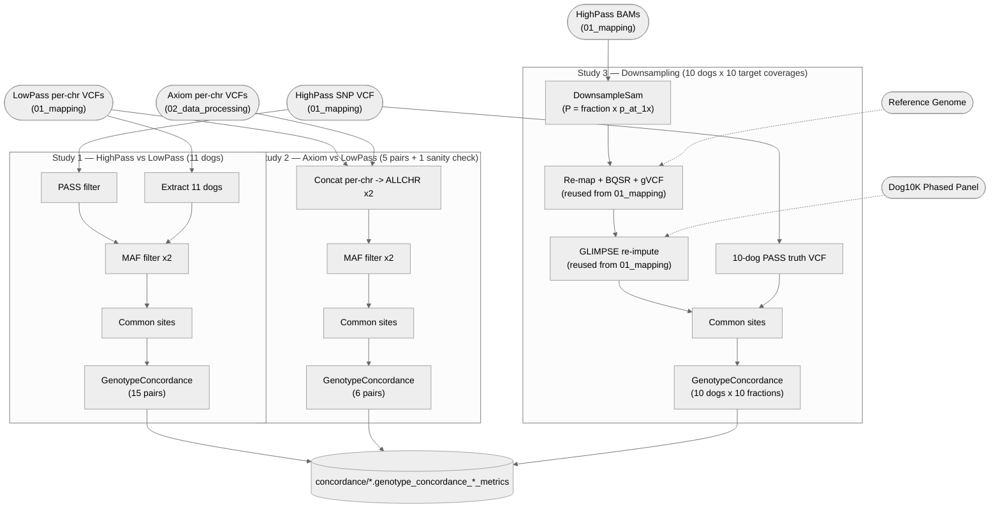

# 03. QC

Three independent genotype-concordance validation studies. None of these feed downstream
analyses (`04_gwas`, `05_network`) — they are terminal QC reports validating that the
sequencing/imputation pipeline (`01_mapping`) produces trustworthy genotypes.

**Pipeline engine:** Nextflow
**Containerized:** Yes (Seqera Wave) — reuses three containers already built for `01_mapping`
(`dog10k_mapping`, `highpass_snpfiltering`, `glimpse-bio` — the latter's derivation is in
[`env/shared/README.md`](../../env/shared/README.md), reused across stages); no new containers
needed.
**Estimated runtime:** [FILL IN]

---

## Pipeline Overview

> Studies 1 and 2 are one-off validation comparisons (no fan-out beyond their fixed pair lists).
> Study 3 reuses `01_mapping`'s mapping/BQSR/gVCF and GLIMPSE-imputation processes directly
> (aliased imports), scattered over an added "downsample fraction" dimension.

---

## Input Data

### Reference files (same as `01_mapping`)

| Parameter | File |
|-----------|------|
| `assembly_ref` | `UU_Cfam_GSD_1.0_ROSY.fa` + `.fai`, `.dict` |
| `known_variants` | `UU_Cfam_GSD_1.0.BQSR.DB.bed.gz` + `.tbi` |
| `chunks_dir` | `chunks_10/` |
| `glimpse_ref_panel` | `AutoAndXPAR.Dog10K.Phased.bcf` + `.csi` |

### Cohort inputs (published by upstream stages)

| Parameter | Source | Description |
|-----------|--------|-------------|
| `highpass_snp_vcf` | `01_mapping` (`highpass/snp_vcf/`) | Jointly-called, hard-filtered HighPass SNP VCF |
| `highpass_bam_dir` | `01_mapping` (`highpass/bam/`) | Per-sample HighPass BAMs (study 3 only) |
| `lowpass_qc_vcf_dir` | `01_mapping` (`lowpass/vcf/`) | Per-chromosome, QC-filtered LowPass VCFs |
| `axiom_lowpass_vcf_dir` | `02_data_processing/2_Axiom_imputation` (`vcf/`) | Per-chromosome Axiom-imputed VCFs |

### Sample lists and pair samplesheets

| Parameter | File | Rows |
|-----------|------|------|
| `samples_highpass_11` | `data/03_qc/samples_to_extract.txt` | 11 SRR accessions |
| `samples_downsampling_10` | `data/03_qc/samples_to_extract_down.txt` | 10 SRR accessions |
| `downsample_p_at_1x` | `data/03_qc/downsample_p_at_1x.csv` | 10 rows: `sample_id,p_at_1x` |
| `concordance_highpass_lowpass_pairs` | `data/03_qc/concordance_highpass_lowpass_pairs.csv` | 15 rows: `pair_id,call_sample,truth_sample` |
| `concordance_axiom_lowpass_pairs` | `data/03_qc/concordance_axiom_lowpass_pairs.csv` | 6 rows: `pair_id,call_sample,truth_sample` |

---

## Output Data

| Path | Description |
|------|-------------|
| `concordance/summary_metrics/*.genotype_concordance_summary_metrics` | Per-pair NON_REF_GENOTYPE_CONCORDANCE summary (studies 1 and 3) |
| `concordance/contingency_metrics/*.genotype_concordance_contingency_metrics` | Per-pair contingency table (study 2) |
| `pipeline_info/versions.yml` | Per-process tool versions |

---

## Process Map

| # | Process | Study | Description |
|---|---------|-------|-------------|
| 1 | `FILTER_PASS_VCF` | 1, 3 | Restrict HighPass VCF to PASS sites |
| 2 | `CONCAT_CHR_VCFS` | 1, 2, 3 | Concatenate per-chromosome VCFs |
| 3 | `EXTRACT_SAMPLES_VCF` | 1, 3 | Restrict a VCF to a fixed sample list |
| 4 | `MAF_FILTER_VCF` | 1, 2 | Exclude sites with MAF < 0.01 |
| 5 | `ISEC_COMMON_SITES` | 1, 2, 3 | Find sites shared between call/truth VCF |
| 6 | `RESTRICT_TO_SITES_VCF` | 1, 2, 3 | Restrict a VCF to the shared site list |
| 7 | `UPDATE_VCF_DICT` | 1, 2, 3 | Fix sequence dictionary before comparison |
| 8 | `GENOTYPE_CONCORDANCE` | 1, 2, 3 | Picard GenotypeConcordance per sample pair |
| 9 | `DOWNSAMPLE_BAM` | 3 | Picard DownsampleSam per (sample, fraction) |
| — | `GLIMPSE_DEFINE_CHUNKS`, `GLIMPSE_VARIABLE_SITES` *(genuinely reused — `include`d directly from `01_mapping/2_cohort_genotyping/process_definitions.nf`, no fraction-dependence)* | 3 | Define imputation chunks, extract variable sites |
| — | `MERGE_BQSR_GVCF_DOWN`, `GLIMPSE_LIKELIHOODS_DOWN`, `GLIMPSE_IMPUTE_CHUNKS_DOWN`, `INDEX_BCFS_DOWN`, `GLIMPSE_LIGATE_DOWN`, `BCF_VCF_DOWN`, `GLIMPSE_QC_FILTER_DOWN` *(locally defined in this stage's own `process_definitions.nf` — mirror `01_mapping`'s equivalents with an added downsample-fraction dimension threaded through, not literally imported)* | 3 | Re-map/BQSR/gVCF + re-impute the downsampled cohort, per fraction |

Steps 2–8 form the `CONCORDANCE_ANALYSIS` subworkflow, invoked once per study (and once more per
downsampling fraction) with different call/truth VCFs and pair lists — the comparison logic
itself is identical across all three studies.

---

## Manual / non-automated steps

- **Axiom genotype calling** (upstream of everything in `02_data_processing`/study 2): the Axiom
  Analysis Suite GUI step that turns raw `.CEL` files into called genotypes predates every script
  in this repository. It is a manual, GUI-based starting checkpoint, not reproduced here.
- **`downsample_p_at_1x` values** (study 3): taken verbatim from the original script's hardcoded
  per-sample table. The depth measurement that originally produced each value is not itself
  documented in the repository — these are frozen, versioned inputs, not recomputed.
- **`dogNO_PAIR` row** in `concordance_axiom_lowpass_pairs.csv`: a deliberate negative control from
  the original script (compares two genotypes known *not* to be the same dog), kept as-is — not a
  data-entry error.

---

## Known characteristics

- `FILTER_PASS_VCF` restricts to PASS sites using `bcftools view -f 'PASS'`.
- The downsampling study (study 3) covers 10 dogs, matching the 10-sample set that was actually
  analyzed and reported (`samples_downsampling_10`).
- Study 3 reuses `01_mapping`'s mapping/BQSR/gVCF and GLIMPSE-imputation processes directly
  (`MERGE_BQSR_GVCF_DOWN`, `GLIMPSE_*_DOWN` in `process_definitions.nf`), with a `meta` (fraction)
  value threaded through every tuple so all 10 fractions run through one call each.
- The MAF < 0.01 exclusion for study 2 (Axiom vs. LowPass) is an explicit `MAF_FILTER_VCF` step
  applied to both VCFs ahead of `ISEC_COMMON_SITES`, the same structure study 1 uses.
- The study-3 downsampling concordance metric is computed against all imputed genotypes regardless
  of GLIMPSE INFO score, not the INFO≥0.8-filtered subset — `CONCAT_CHR_VCFS` consumes
  `BCF_VCF_DOWN`'s pre-filter output.
