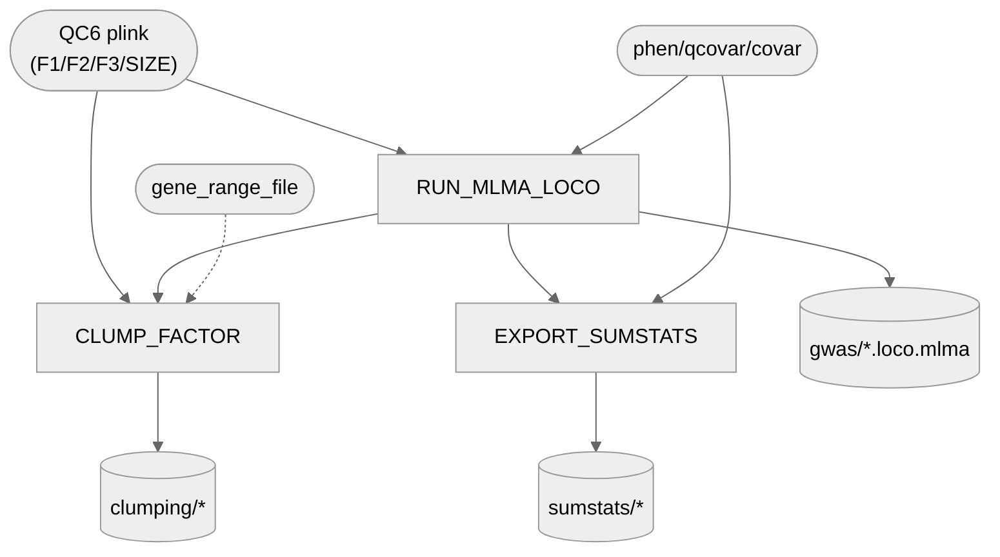

# 04. GWAS — 1. MLMA-LOCO (factors + SIZE)

Per-phenotype mixed-linear-model GWAS (`--mlma-loco`) for the 3 dogCD factors and SIZE, plus plink
clumping + sumstats export feeding [`3_finemap_susie`](../3_finemap_susie).

**Pipeline engine:** Nextflow
**Containerized:** Yes (Seqera Wave) — reuses `3_Merging_filtering`'s gcta64+R container and the
existing plink container; no new build needed.
**Estimated runtime:** [FILL IN]

---

## Pipeline Overview



---

## Input Data

No samplesheet — inputs are direct file/directory params (see
[`nextflow_schema.json`](nextflow_schema.json) for the full list).

| Parameter | File | Source |
|-----------|------|--------|
| `qc6_plink_dir` | `CCD{F1,F2,F3}_..._QC6.{bed,bim,fam}`, `SIZE_..._QC6.{bed,bim,fam}` | `3_Merging_filtering`'s published `plink/` output |
| `phenotypes_dir` | `.phen`/`.qcovar`/`.covar` files per phenotype | `3_Merging_filtering`'s published `phenotypes/` output |
| `gene_range_file` | `genes6_UU_Cfam_GSD_1.0_ROSY.txt` | Gene-range file for `plink --clump-range` (UU_Cfam_GSD_1.0_ROSY assembly) — derived from the Dog10K curated NCBI v106 GTF by `pixi run 00a-fetch-reference-data` (checksum-verified, byte-identical to the file used for the published clumping) |

---

## Output Data

| Path | Description |
|------|-------------|
| `gwas/*_LOCO.loco.mlma` | Per-phenotype mlma-loco GWAS summary statistics |
| `gwas/*_LOCO.log` | mlma-loco run logs |
| `clumping/*_clump250.clumped(.ranges/.log)` | Plink-clumped regions, F1/F2/F3 |
| `clumping/size/*_clump250.clumped(.ranges/.log)` | Plink-clumped regions, SIZE |
| `sumstats/*_sumstats.txt` | PolyFun-ready summary statistics, F1/F2/F3 — feeds `3_finemap_susie` |
| `sumstats/size/*_sumstats.txt` | PolyFun-ready summary statistics, SIZE |

---

## Process Map

| # | Process | Description |
|---|---------|-------------|
| 1 | `RUN_MLMA_LOCO` | gcta64 `--mlma-loco` GWAS |
| 2 | `CLUMP_FACTOR` | plink `--clump`/`--clump-range` region-finding |
| 3 | `EXPORT_SUMSTATS` | Reformats mlma-loco output for PolyFun finemapping |

All 4 phenotypes (F1/F2/F3 + SIZE) run through every process above uniformly.

---

## Notes

- `--autosome-num 38` is hardcoded (matches `RUN_MLMA_LOCO`'s existing convention, not yet a
  pipeline param). `--thread-num`/CPU counts are set from `task.cpus`, not hardcoded — thread
  count doesn't affect GWAS results, only wall-clock time.
- No GRM-building/GCTA-GREML heritability step here — Fig 1b's heritability values are cited to
  `github.com/VistaSohrab/dog-gwas-heritability-nextflow` (calculation) and Supplementary Table 4
  (published result), not recomputed in this repo. See `archive/conversion_notes/04_gwas.md` for
  the GRM/REML step this pipeline briefly had (added, then removed again, 2026-09-15).

---

## Manual / non-automated: batch-covariate calibration check (F1 only)

**Separate from, and not run as part of, the `RUN_MLMA_LOCO` pipeline above.** A one-off QC check
for whether including sequencing/genotyping `batch` as a GWAS covariate changes calibration for
Factor 1 — the data behind the manuscript's "batch-covariate-in-GWAS comparison" text
(`REVIEW_AND_SUGGESTIONS.md`'s open items list this as needing to move from Results to Supp
Info). Two loose, un-converted scripts in this directory do the actual work:
[`MLMA_PER_FACTOR.sh`](MLMA_PER_FACTOR.sh) (GCTA, run twice with different covariates) and
[`compare_batch_gwas_calibration.R`](compare_batch_gwas_calibration.R) (the comparison itself —
λ_GC, per-SNP correlation, significance-threshold breakdown).

**To reproduce:**

1. **No-batch run** — this is the *same* run `RUN_MLMA_LOCO` already produces for F1 via the live
   pipeline above. Take `data/results/04_gwas/1_mlma-loco/gwas/CCDF1_..._LOCO.loco.mlma` and copy
   it to `CCDF1_QC6_sex_age.mlma` (the R script's expected filename — note the `.loco` needs
   dropping, GCTA's own `--out` naming doesn't match what the R script reads).
2. **With-batch run** — manually re-run the same GCTA command as `MLMA_PER_FACTOR.sh` line 43,
   swapping the covariate file for the batch-inclusive one
   (`data/04_gwas/sex_batchCCDF1_DA_MERGED_GENCOVE_AXIOM_QC6.covar` — batch in column 3, sex in
   column 4):
   ```bash
   gcta64 --mlma-loco --bfile CCDF1_DA_MERGED_GENCOVE_AXIOM_QC6 \
     --pheno CCDF1_DA_MERGED_GENCOVE_AXIOM_QC6.phen \
     --qcovar ageCCDF1_DA_MERGED_GENCOVE_AXIOM_QC6.qcovar \
     --covar sex_batchCCDF1_DA_MERGED_GENCOVE_AXIOM_QC6.covar \
     --thread-num 16 --autosome-num 38 \
     --out CCDF1_QC6_sex_age_batch
   ```
   Rename the resulting `CCDF1_QC6_sex_age_batch.loco.mlma` to `CCDF1_QC6_sex_age_batch.mlma`
   (same `.loco`-dropping rename as step 1).
3. **Compare** — edit `compare_batch_gwas_calibration.R`'s hardcoded `setwd()` (line 21) to point
   at the directory holding both renamed `.mlma` files, then run it interactively or via
   `Rscript compare_batch_gwas_calibration.R`. Produces `pval_comparison_per_snp.csv` and
   `sig_vs_diff_scatter.png`, plus console output (λ_GC for both models, per-SNP correlation,
   the single largest-shifted SNP, and counts of suggestive/genome-wide SNPs with ≥1
   order-of-magnitude p-value shifts) — the numbers that belong in the Supp Info text.

`data/04_gwas/ALLFAM_sex_age_phenos.txt`/`ALLFAM_sex_age_phenos_batch.txt` (cohort-wide, not
F1-filtered) are related exploratory covariate tables from the same batch-effect investigation —
see `data/04_gwas/README.md`.
