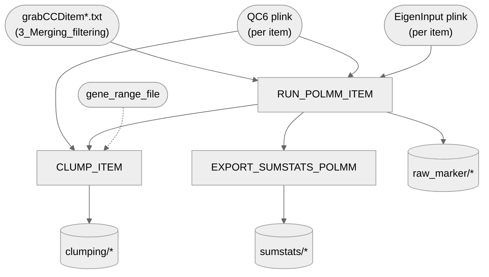

# 04. GWAS — 2. POLMM (14 survey items)

Per-item proportional-odds logistic mixed-model GWAS (`GRAB::POLMM`) for all 14 dogCD survey
items, plus plink clumping + sumstats export feeding
[`3_finemap_susie`](../3_finemap_susie).

**Pipeline engine:** Nextflow
**Containerized:** Yes (Seqera Wave)
**Estimated runtime:** [FILL IN]

---

## Pipeline Overview

All 14 items run through every process uniformly, driven by `getItemIds()` in the entry workflow.

---

## Input Data

No samplesheet — inputs are direct file/directory params (see
[`nextflow_schema.json`](nextflow_schema.json)).

| Parameter | File | Source |
|-----------|------|--------|
| `phenotypes_dir` | `grabCCDitem<id>_DA_MERGED_GENCOVE_AXIOM_QC6.txt` (14 files) | `3_Merging_filtering`'s published `phenotypes/` output |
| `qc6_plink_dir` | `CCDitem<id>_..._QC6.{bed,bim,fam}` and `CCDitem<id>_EigenInput.{bed,bim,fam}` (14 each) | `3_Merging_filtering`'s published `plink/` output |
| `gene_range_file` | `genes6_UU_Cfam_GSD_1.0_ROSY.txt` | Gene-range file for `plink --clump-range` — derived from the Dog10K curated NCBI v106 GTF by `pixi run 00a-fetch-reference-data` (checksum-verified, byte-identical to the file used for the published clumping) |

---

## Output Data

| Path | Description |
|------|-------------|
| `raw_marker/*` | Per-item raw `GRAB::POLMM` marker-test output |
| `sumstats/modi_simuMarkerOutput_POLMM_item*_sumstats.txt` | Reformatted per-item sumstats (also feeds `CLUMP_ITEM`) |
| `clumping/*_clump250.clumped(.ranges/.log)` | Plink-clumped regions, per item |
| `sumstats/*_sumstats.txt` (PolyFun-ready) | Feeds `3_finemap_susie` |
| `pipeline_info/versions.yml` | Per-process tool versions |

---

## Process Map

| # | Process | Description |
|---|---------|-------------|
| 1 | `RUN_POLMM_ITEM` | `GRAB::POLMM` proportional-odds mixed-model marker test, one item at a time |
| 2 | `CLUMP_ITEM` | plink `--clump`/`--clump-range` region-finding over the POLMM sumstats |
| 3 | `EXPORT_SUMSTATS_POLMM` | Reformats POLMM output for PolyFun finemapping |

---

## Container

Three Seqera Wave containers: `polmm_grab` (the GRAB R package providing `POLMM`, for
`RUN_POLMM_ITEM`), the shared `plink` container (`CLUMP_ITEM`), and
`3_Merging_filtering`'s `merging_filtering_tools` container (`EXPORT_SUMSTATS_POLMM`). See each
process's own `container` directive in `process_definitions.nf` for exact tags.
