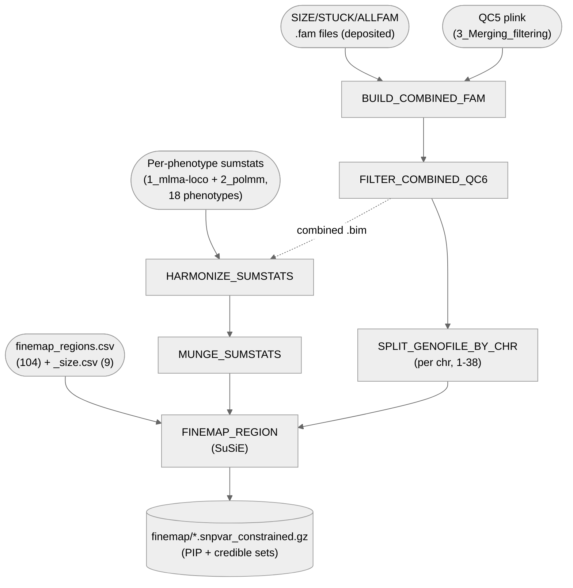

# 04. GWAS — 3. Fine-mapping (SuSiE via PolyFun)

Fine-maps 104 hand-picked GWAS regions (+ 9 SIZE-specific windows) across all 18 phenotypes
(3 factors + 14 items + SIZE) using PolyFun/SuSiE, producing per-SNP posterior inclusion
probabilities (PIP) and credible sets.

**Pipeline engine:** Nextflow
**Containerized:** Yes (Seqera Wave) — one new container, `polyfun` (PolyFun,
github.com/omerwe/polyfun, has no conda/bioconda package)
**Estimated runtime:** [FILL IN]

---

## Pipeline Overview

SIZE is kept in its own published subdirectories throughout (same "keep SIZE separated" split as
`1_mlma-loco`) — it runs through the identical `HARMONIZE_SUMSTATS`/`MUNGE_SUMSTATS`/
`FINEMAP_REGION` processes as the 17 other phenotypes, but its outputs never mix into the main
`sumstats//finemap/` directories; every SIZE output filename is prefixed `SIZE_`.

---

## Input Data

No samplesheet — inputs are direct file/directory params (see
[`nextflow_schema.json`](nextflow_schema.json)).

| Parameter | File | Source |
|-----------|------|--------|
| `qc6_plink_dir` | `DA_MERGED_GENCOVE_AXIOM_QC5.{bed,bim,fam}` | `3_Merging_filtering`'s published `plink/` dir (holds both QC5 and QC6 files — reuses the same param `1_mlma-loco`/`2_polmm` use, not a separate `qc5_plink_dir`) |
| `mlma_sumstats_dir` | `CCD{F1,F2,F3}_sumstats.txt` | `1_mlma-loco`'s published `sumstats/` |
| `polmm_sumstats_dir` | `ITEM<id>_sumstats.txt` (14 files) | `2_polmm`'s published `sumstats/` |
| `size_sumstats_dir` | `SIZE_sumstats.txt` | `1_mlma-loco`'s published `sumstats/size/` |
| `size_fam` / `stuck_fam` / `allfam_fam` | `{SIZE,STUCK,ALLFAM}_DA_MERGED_GENCOVE_AXIOM_QC6.fam` | [`data/04_gwas/`](../../../data/04_gwas) — deposited, not built by any pipeline |

Fine-mapping regions are bundled assets, not params: [`assets/finemap_regions.csv`](assets/finemap_regions.csv)
(104 hand-picked regions) and [`assets/finemap_regions_size.csv`](assets/finemap_regions_size.csv)
(9 SIZE-specific windows).

---

## Output Data

| Path | Description |
|------|-------------|
| `combined_qc6/*` | Combined QC6 plinkset (QC5 + SIZE/STUCK/ALLFAM fam merge) |
| `chr_geno/*` | Per-chromosome genotype split (1–38) |
| `harmonized_sumstats/*` | Per-phenotype sumstats harmonized against the combined `.bim` |
| `munged_sumstats/*.parquet` | PolyFun-munged sumstats |
| `finemap_results/*` (+ `*_size` variants) | Per-region, per-phenotype SuSiE fine-mapping output — PIP + credible sets |
| `pipeline_info/versions.yml` | Per-process tool versions |

---

## Process Map

| # | Process | Container | Description |
|---|---------|-----------|-------------|
| 1 | `BUILD_COMBINED_FAM` | `merging_filtering_tools` | Merges QC5's `.fam` with SIZE/STUCK/ALLFAM `.fam` files |
| 2 | `FILTER_COMBINED_QC6` | `plink` | Applies the combined fam to QC5's `.bed`/`.bim` |
| 3 | `SPLIT_GENOFILE_BY_CHR` | `plink` | Splits the combined genofile into one plinkset per chromosome |
| 4 | `HARMONIZE_SUMSTATS` | `polyfun` | Harmonizes each phenotype's sumstats against the combined `.bim` (allele/strand reconciliation) |
| 5 | `MUNGE_SUMSTATS` | `polyfun` | PolyFun's sumstats munging step |
| 6 | `FINEMAP_REGION` | `polyfun` | Runs SuSiE fine-mapping over one (region, phenotype) pair |

---

## Notes

- `HARMONIZE_SUMSTATS` is fed the *combined* `.bim` via `.collect()` (not `.first()`) specifically
  so an unexpected extra emission stays visible rather than being silently dropped — see the
  entry workflow's own comment on this channel-broadcasting choice.
- 104 + 9 = 113 total (region, phenotype-set) fine-mapping targets, each further multiplied across
  every phenotype assigned to that region via `assets/finemap_regions{,_size}.csv`'s own
  `pheno_id` column.

---

## Standalone scripts (not pipeline-wired)

- [`bin/build_st5_st6_region_ids.py`](bin/build_st5_st6_region_ids.py) — reproduces and traces the
  region/gene counts behind Supplementary Tables 5 and 6 (the manuscript's "27 significant /
  28 suggestive regions" and "46/41 genes" figures) directly from the deposited
  `NATURE_SupplementaryTables.xlsx`. Deliberately not a Nextflow process or pixi task — a one-off
  verification/deliverable-building script, run manually:
  `python3 build_st5_st6_region_ids.py <NATURE_SupplementaryTables.xlsx> <CCDgenes_Oct25.txt seed list> <output dir>`.
  See the script's own module docstring for the region-merging rule and full output description.

---

## Container

`polyfun` is the one new container this substage needed (PolyFun has no conda/bioconda package,
see `process_definitions.nf`'s header comment) — used by `HARMONIZE_SUMSTATS`, `MUNGE_SUMSTATS`,
and `FINEMAP_REGION`. `BUILD_COMBINED_FAM` reuses `3_Merging_filtering`'s `merging_filtering_tools`
container; `FILTER_COMBINED_QC6`/`SPLIT_GENOFILE_BY_CHR` reuse the shared `plink` container.
