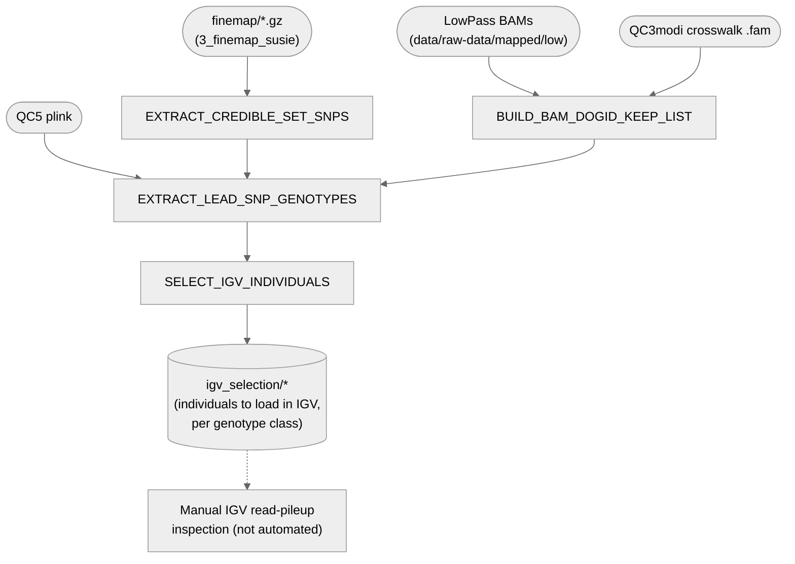

# 04. GWAS — 4. QC signals (IGV)

Prepares everything needed for the manual IGV visual-inspection QC step: the lead-SNP list (top
SNP per credible set from fine-mapping), which sequenced dogs have BAMs available, their
genotypes at those lead SNPs, and a representative individual selection per genotype class.
**The actual IGV read-pileup inspection is manual and not automated** — see below.

**Pipeline engine:** Nextflow
**Containerized:** Yes (Seqera Wave) — reuses `3_finemap_susie`'s `polyfun` container (Python
steps) and the shared `plink` container (genotype extraction); no new build.
**Estimated runtime:** [FILL IN]

---

## Pipeline Overview

`check_signals_igv_manually.sh` (in this directory) is the original, un-converted manual
reference script — kept for provenance, not run as part of this pipeline.

---

## Input Data

No samplesheet — inputs are direct file/directory params (see
[`nextflow_schema.json`](nextflow_schema.json)).

| Parameter | File | Source |
|-----------|------|--------|
| `finemap_results_dir` | `*.gz` (SuSiE output, every region/phenotype) | `3_finemap_susie`'s published `finemap/` |
| `bam_dir` | LowPass BAMs (flat directory) | `data/raw-data/mapped/low` — materialized by `mapping-batched`, not published under `data/results/01_mapping` (`2_cohort_genotyping` doesn't publish per-sample BAMs, see its own header comment) |
| `qc6_plink_dir` | `DA_MERGED_GENCOVE_AXIOM_QC5.{bed,bim,fam}` | `3_Merging_filtering`'s published `plink/` dir |
| `crosswalk_fam` | `DA_MERGED_GENCOVE_AXIOM_QC3modi.fam` | [`data/02_data_processing/`](../../../data/02_data_processing) — deposited; doubles as the sampleID↔dogID crosswalk |
| `n_per_class` / `seed` / `round` | — | Individual-selection tuning (3 per genotype class, seed 42, round 1 by default — re-run with a different `round` for a fresh batch) |

---

## Output Data

| Path | Description |
|------|-------------|
| `lead_snps/*` | Top-P SNP per credible set, across every fine-mapping result file |
| `bam_dogid_keep_list/*` | BAM-having sample IDs mapped to dogID, plus unmatched IDs |
| `lead_snp_genotypes/*` | Genotypes at every lead SNP, restricted to BAM-having dogs |
| `igv_selection/*` | Selected individuals per genotype class, for manual IGV loading |
| `pipeline_info/versions.yml` | Per-process tool versions |

---

## Process Map

| # | Process | Description |
|---|---------|-------------|
| 1 | `EXTRACT_CREDIBLE_SET_SNPS` | Top-P SNP per credible set, across every `3_finemap_susie` result file |
| 2 | `BUILD_BAM_DOGID_KEEP_LIST` | Maps BAM-having sample IDs to dogID via the QC3modi crosswalk |
| 3 | `EXTRACT_LEAD_SNP_GENOTYPES` | plink genotype extraction at the lead SNPs, restricted to BAM-having dogs |
| 4 | `SELECT_IGV_INDIVIDUALS` | Picks a representative sample of individuals per genotype class for manual review |

---

## Manual / non-automated steps

- **The IGV read-pileup inspection itself** is manual — a human loads the selected individuals'
  BAMs at each lead SNP in IGV and visually judges signal quality (clean het pileup vs. strand
  bias/artifacts). Not automated, and not intended to be: this is exactly the kind of
  human-in-the-loop checkpoint `REPRODUCIBILITY_AUDIT.md` treats as acceptable provided the
  verdict is recorded (see that file's "Human-in-the-loop checkpoints" section for the proposed
  decision-manifest format).

---

## Container

Reuses `3_finemap_susie`'s `polyfun` container for the three Python steps (pandas is already
needed elsewhere in that container; not worth sourcing a second container for one small script)
and the shared `plink` container for `EXTRACT_LEAD_SNP_GENOTYPES`. No new build.
