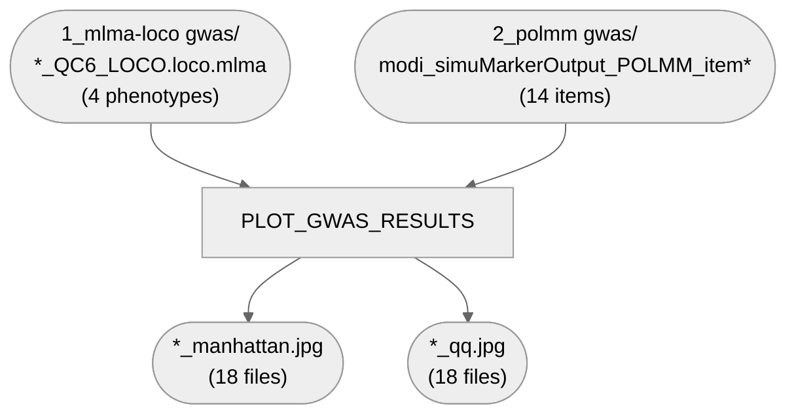

# 04. GWAS — 5. Plotting

Manhattan + QQ plots for Fig 1c: one pair per mlma-loco phenotype (`CCDF1`, `CCDF2`, `CCDF3`,
`SIZE`) and one pair per polmm survey item (all 14: `7`, `93`, `95`, `145`-`155`).

**Pipeline engine:** Nextflow
**Containerized:** Yes (Seqera Wave)
**Estimated runtime:** [FILL IN]

---

## Pipeline Overview

Moved here from `07_additional_plots_and_analyses/plot_gwas_results.R` (2026-09-16) — it plots
`1_mlma-loco`'s and `2_polmm`'s own outputs, so it belongs alongside its real parent stage, same
reasoning as the earlier GO-semantic-clustering move into `05_network`.

## Inputs

| Param | Description |
|---|---|
| `mlma_dir` | `1_mlma-loco`'s published `gwas/` directory |
| `polmm_dir` | `2_polmm`'s published `gwas/` directory |

## Outputs

18 Manhattan plots + 18 QQ plots (one pair per phenotype/item), published under `plotting/`.

## Container

`gwas_supplement_plots` (`r-base`, `r-tidyverse`, `r-data.table`, `r-readxl`, `r-ggrepel`,
`r-qqman`) — shared with `07_additional_plots_and_analyses/1_heritability_plot` and
`2_gwas_catalog_overlap`. See `env/shared/README.md` for the build story.
