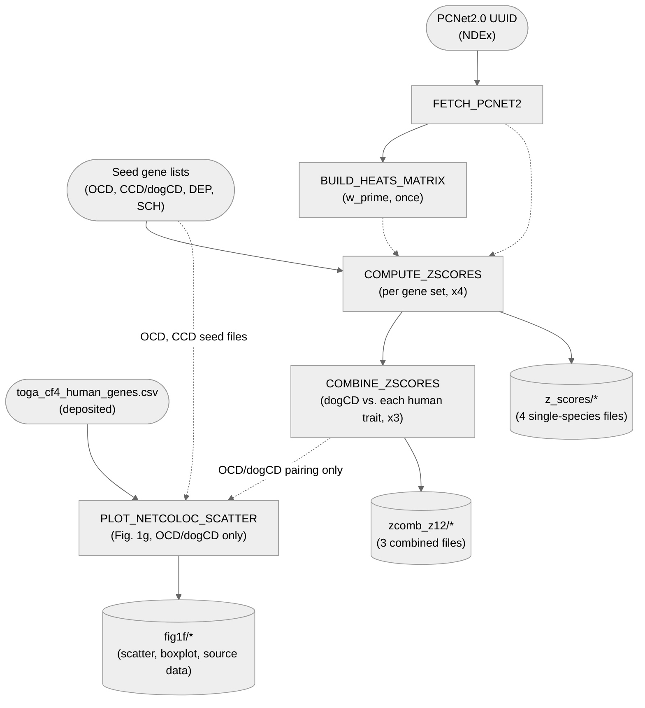

# 05. Network — 1. NetColoc

Network-propagation z-scores over PCNet2.0 for 4 gene sets (dogCD, OCD, depression,
schizophrenia), then combines dogCD against each of the 3 human traits to get 3 cross-species
combined z-score files feeding [`2_CrossSpeciesBMI`](../2_CrossSpeciesBMI). Also plots Fig. 1g
(dogCD-vs-OCD z-score scatter) directly from the OCD/dogCD combined file.

**Pipeline engine:** Nextflow
**Containerized:** Yes (Seqera Wave) — one new container, `netcoloc`, plus the shared
`gwas_supplement_plots` R container for the Fig. 1g plotting step
**Estimated runtime:** [FILL IN]

---

## A note on variable naming

`CrossSpeciesBMI` (the downstream tool this stage feeds) was originally written for a human-rat
BMI comparison. Variable/column/dictionary-key names throughout its scripts and notebooks still
reflect that — most visibly `r`/`rat` naming (`NPS_r`, `rBMI`, `seed_bin_rat_BMI`) — and were
never renamed when this project repurposed the code for a human-dog comparison. Wherever you see
`r`/`rat`, read it as **dog**; `h`/`human` keeps its literal meaning. The original code confirms
this itself (`2.1_OCD_dogCD_Network_Colocalization_260521.ipynb` cell 60: `# all dog are called
rat`).

---

## Pipeline Overview

PCNet2.0 is fetched and the propagation matrix built **once**, then reused for all 4 gene sets —
a deliberate simplification over the original notebooks' own redundant per-cross-species-pairing
recomputation (matrix-building is deterministic, so recomputing it per pairing added nothing).
The score cutoffs used downstream: NPSd or NPSh > 1.5 and NPShd > 3 for cross-species pairings;
NPS > 3 for single-species. (`z-score = NPS` throughout.)

---

## Input Data

No samplesheet — inputs are direct file/directory params (see
[`nextflow_schema.json`](nextflow_schema.json)).

| Parameter | Description | Default |
|-----------|-------------|---------|
| `pcnet_uuid` | NDEx interactome UUID | `d73d6357-e87b-11ee-9621-005056ae23aa` (PCNet2.0, 19,267 nodes / 3,852,119 edges) |
| `seed_genes_dir` | Directory holding the 4 seed-gene files | [`data/05_network/`](../../../data/05_network) — `OCDgenes_v4.txt`, `CCDgenes_Oct25.txt`, `human_DEP_noMHC_seed_genes_header.txt`, `human_schiz_seed_genes_header.txt` |
| `toga_file` | TOGA human-dog 1:1 orthologue mapping, used only by `PLOT_NETCOLOC_SCATTER` (Fig. 1g) | [`data/05_network/toga_cf4_human_genes.csv`](../../../data/05_network/toga_cf4_human_genes.csv) — deposited |

---

## Output Data

| Path | Description |
|------|-------------|
| `interactome/*` | Fetched PCNet2.0 network |
| `w_prime/*` | Propagation matrix (deterministic — can be rebuilt, or reused across runs) |
| `indiv_heats_matrix/*` | Per-individual heats matrix (the ~2.8 GB `.npy`, per the original deposited-vs-rerun note) |
| `z_scores/*` | Per-gene-set network-propagation z-scores (OCD, dogCD/CCD, DEP, SCH) |
| `zcomb_z12/*` | dogCD-vs-human-trait combined z-scores (3 files: dogCD/OCD, dogCD/DEP, dogCD/SCH) — feeds `2_CrossSpeciesBMI` |
| `fig1f/ocd_ccd_tab.tsv` | OCD/dogCD combined z-score table, same values as `zcomb_z12/OCD_CCD_zcomb_z12.tsv` under `D1_z`/`D2_z`/`zcomb` column names |
| `fig1f/orthology_class_boxplot.pdf` | Diagnostic plot: combined z-score distribution by TOGA orthology class — feeds nothing downstream |
| `fig1f/Figure_1f_source_data.tsv` | Per-gene z-scores, orthology class, conserved-network flag, plot color/label — the data behind Fig. 1g |
| `fig1f/fig1f_scatter.pdf` | Fig. 1g: dogCD (NPS_d) vs. human OCD (NPS_h) z-score scatter, colored by seed-gene/conserved-network status |
| `pipeline_info/versions.yml` | Per-process tool versions |

---

## Process Map

| # | Process | Description |
|---|---------|-------------|
| 1 | `FETCH_PCNET2` | Fetches the PCNet2.0 interactome from NDEx by UUID |
| 2 | `BUILD_HEATS_MATRIX` | Builds the propagation matrix (`w_prime`) — deterministic |
| 3 | `COMPUTE_ZSCORES` | Network-propagation z-scores for one gene set at a time (x4) |
| 4 | `COMBINE_ZSCORES` | Combines dogCD's z-scores against each human trait's (x3) |
| 5 | `PLOT_NETCOLOC_SCATTER` | Fig. 1g scatter plot + diagnostic orthology-class boxplot, from the OCD/dogCD combined z-scores |

---

## Notes

**The NPS-threshold sensitivity analysis (Supplementary Table 7) is not re-executed live by
default.** The source notebook (`1.1_OCD_dogCD_NetColoc_analysis_260521.ipynb`, cell 28) calls
`network_colocalization.calculate_network_enrichment(z_D1, z_D2, zthresh_list=[2,3,4,5,9,12],
z12thresh_list=[1,1.5,2])` — sweeping the combined/individual z-score thresholds to justify the
NPSh > 1.5 / NPSd > 1.5 / NPShd > 3.0 cutoff used downstream. That code is real and its committed
output (`data/05_network/netcoloc_enrichment_df_CCD_OCD_251022.csv`) matches Supplementary Table 7
exactly. It is not wired into any process here: the source cell is explicitly marked "OBS do not
rerun!!!" (a stability/runtime concern, not correctness), so this pipeline has no
`COMPUTE_SENSITIVITY`-style process — the frozen CSV is the only place this result lives.

**HiDeF community detection and the cosine-similarity subgraph transform are also part of this
stage's original analysis, but not re-executed live — and their frozen output ends up in
`2_CrossSpeciesBMI`, not here.** Real code, same source notebook (`1.1_OCD_dogCD_NetColoc_analysis_260521.ipynb`,
cells 37/42): `network_colocalization.transform_edges(..., edge_weight_threshold=0.95)` builds the
cosine-similarity subgraph, then `cdapsutil.CommunityDetection().run_community_detection(...,
algorithm='hidefv1.1beta', arguments={'--maxres':'20'})` runs HiDeF on it. Not wired into this
pipeline for two reasons: it calls out to an external CDAPS REST service, and per the companion
notebook's own note, "the hierarchical community detection process is not deterministic" — a
rerun wouldn't reproduce the same communities. The frozen result is assembled together with manual
Cytoscape layout (see [`3_Cytoscape`](../3_Cytoscape)) into the deposited systems-map/hierarchy
files `2_CrossSpeciesBMI`'s `MERGE_HIERARCHY` process consumes
(`OCDv4_CCD_Oct25_systems_map.txt`, `CompulsiveNetwork_hierarchy_data_251022.tsv`) — this pipeline
stops at `COMBINE_ZSCORES` and never runs community detection itself.

**`PLOT_NETCOLOC_SCATTER` (Fig. 1g) was converted 2026-09-21 from a loose, undocumented script.**
`plot_netcoloc_zscores.R` sat in this directory (not `bin/`, not wired into any process, not
mentioned in this README) with a hardcoded absolute `setwd()` and no CLI args. Its own comment
(`### plot for Fig 1e ####`) and the source notebook's markdown (`1.1_...ipynb` cell 25: "make
scatter plot for Figure 1e") predate the manuscript's panel lettering, which has since shifted
twice — first to Fig. 1f, now to the current Fig. 1g (a power-analysis panel was inserted earlier
in Fig. 1 on 2026-09-25, shifting every panel from the old Fig. 1d onward up one letter). Converted
into `bin/plot_netcoloc_zscores.R`: `setwd()`/hardcoded paths replaced with CLI
args, and the script now reads `COMBINE_ZSCORES`'s own `OCD_CCD_zcomb_z12.tsv` output directly
instead of recomputing the same `full_join` + multiply from raw per-trait z-score files (verified
numerically identical to the original's own recomputation first). `library(eulerr)` dropped
(loaded in the original but never called anywhere in it). Verified end-to-end against real data:
output source-data table matches the real, previously-deposited
`data/05_network/Figures/Figure_1e_source_data.csv` to floating-point noise (max diff ~1e-14) on
all 18,725 rows, zero mismatches in color/label classification, and the regenerated plot is
visually identical to the published Fig. 1g panel.

---

## Additional tools

- **NDEx** (https://www.ndexbio.org/) — interactome source; login is interactive/credential-based,
  deliberately not automated.
- **Cytoscape** (v3.10.2 used originally) — downstream visualization, see
  [`3_Cytoscape`](../3_Cytoscape).

---

## Container

One new Seqera Wave container, `netcoloc` — shared with `2_CrossSpeciesBMI` (not scope creep: the
analyst used one conda environment for both stages in sequence). See
[`env/05_network/README.md`](../../../env/05_network/README.md).

`PLOT_NETCOLOC_SCATTER` (Fig. 1g) is pure R/ggplot2, not part of that Python environment — it
reuses the shared `gwas_supplement_plots` container instead (see
[`env/shared/README.md`](../../../env/shared/README.md)), same one `04_gwas/5_plotting`,
`1_heritability_plot`, and `2_gwas_catalog_overlap` already use.
