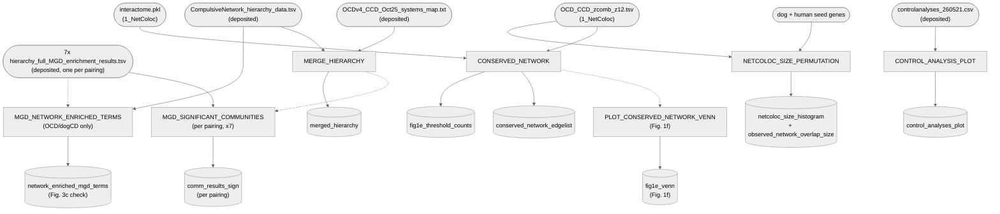

# 05. Network — 2. CrossSpeciesBMI

Builds the dogCD/OCD conserved network (Fig. 1f), the colocalization-size permutation test
(Fig. 1h), the control-trait comparison bar plot (Fig. 1i), and the dogCD/OCD systems-map
hierarchy (Fig. 2a/3a) — all four scoped specifically to the dogCD/OCD pairing.

Also runs per-community MGD (mouse phenotype ontology) significant-enrichment testing,
generalized across all 7 systems-map pairings (3 cross-species + 4 single-species) — all 7 have a
real deposited MGD result. Only the dogCD/OCD pairing is reported in the results (Fig. 3c,
community C185, assembled manually in Cytoscape/Illustrator); the other 6 pairings' outputs are
computed but unused.

Additionally, for the dogCD/OCD pairing only, checks the manuscript Results sentence describing
Fig. 3c (how many MP terms are "enriched in the OCD/dogCD combined network" and how many of those
are "associated with" C185 specifically) against the deposited data — see Notes below.

GO Biological Process enrichment is deposited for the same 7 pairings, but only 6 (the 3
cross-species pairings plus their 3 human-only counterparts — excluding dogCD alone, which has no
comparison baseline) are actually used, by `5_GO_semantic_clustering`. Neither the MGD nor the GO
computation is re-executed live here or anywhere else in this repo — both come from the same
original source notebook (`2.2_OCD_dogCD_Systems_Map_260521.ipynb`); see Notes below for why.

**Pipeline engine:** Nextflow
**Containerized:** Yes (Seqera Wave) — reuses `1_NetColoc`'s `netcoloc` container, no new build.
**Estimated runtime:** [FILL IN]

---

## Pipeline Overview

`getMgdPairings()` in the entry workflow generalizes `MGD_SIGNIFICANT_COMMUNITIES` across all 7
systems-map pairings (3 cross-species + 4 single-species), not just the OCD-CCD pairing the
source notebook's own cells literally show — each pairing has a real, correctly-formatted
deposited MGD enrichment result. `OCD_ONLY`'s deposit originally had unrelated LDSC annotation
content in a different export format than its siblings;
[`reformat_ocd_only_mgd_results.py`](reformat_ocd_only_mgd_results.py) normalizes it to match
(run once, not part of the live DAG).

---

## Input Data

No samplesheet — inputs are direct file params (see
[`nextflow_schema.json`](nextflow_schema.json)).

| Parameter | File | Source |
|-----------|------|--------|
| `ocd_ccd_zcomb_z12` | `OCD_CCD_zcomb_z12.tsv` | `1_NetColoc`'s published `zcomb_z12/` |
| `interactome` | `interactome.pkl` | `1_NetColoc`'s published `interactome/` |
| `dog_seed_genes` / `human_seed_genes` | `CCDgenes_Oct25.txt` / `OCDgenes_v4.txt` | [`data/05_network/`](../../../data/05_network) — deposited |
| `control_results` | `controlanalyses_260521.csv` | [`data/05_network/`](../../../data/05_network) — deposited, **not re-executed live by this pipeline** — see Notes below |
| `ocd_ccd_systems_map` | `OCDv4_CCD_Oct25_systems_map.txt` | [`data/05_network/`](../../../data/05_network) — deposited, **HiDeF output, not re-executed live** — see Notes below |
| `ocd_ccd_hierarchy` | `CompulsiveNetwork_hierarchy_data_251022.tsv` | [`data/05_network/`](../../../data/05_network) — deposited, **HiDeF output, not re-executed live** — see Notes below. Also feeds `MGD_NETWORK_ENRICHED_TERMS` |
| `mgd_enrichment_dir` | 7x `*_hierarchy_full_MGD_enrichment_results.tsv` | [`data/05_network/`](../../../data/05_network) — deposited, one per pairing, **not re-executed live by this pipeline** — see Notes below. Also feeds `MGD_NETWORK_ENRICHED_TERMS` (OCD/dogCD's file only) |

---

## Output Data

| Path | Description |
|------|-------------|
| `conserved_network_edgelist/*` | dogCD/OCD conserved network edge list — the "colocalized network, orange" gene set behind Fig. 1f |
| `fig1e_threshold_counts/*` | Fig. 1f gene counts (NPSh > 1.5, NPSd > 1.5, overlap, colocalized) + hypergeometric overlap p-value |
| `fig1e_venn/fig1e_venn.pdf` | Fig. 1f: 2-circle Venn (NPSh-only / colocalized / NPSd-only) |
| `netcoloc_size_histogram/*`, `observed_network_overlap_size/*` | Colocalization-size permutation test output (Fig. 1h) |
| `control_analyses_plot/*` | Control-trait comparison bar plot (Fig. 1i) |
| `merged_hierarchy/*` | Merged dogCD/OCD systems-map hierarchy (Fig. 2a/3a) |
| `comm_results_sign/*` | Per-pairing significant-community MGD enrichment (x7) |
| `network_enriched_mgd_terms/*` | OCD/dogCD-only: MP terms enriched in the network (root + immediate sub-communities), traced per community (Fig. 3c check — see Notes) |
| `pipeline_info/versions.yml` | Per-process tool versions |

---

## Process Map

| # | Process | Description |
|---|---------|-------------|
| 1 | `CONSERVED_NETWORK` | Builds the dogCD/OCD conserved-network edge list, plus Fig. 1f's threshold gene counts and hypergeometric overlap test |
| 2 | `PLOT_CONSERVED_NETWORK_VENN` | Fig. 1f 2-circle Venn, from `CONSERVED_NETWORK`'s own gene counts |
| 3 | `NETCOLOC_SIZE_PERMUTATION` | Observed vs. permuted-null colocalization size test |
| 4 | `CONTROL_ANALYSIS_PLOT` | Control-trait comparison bar plot (reloads a frozen result — see Notes) |
| 5 | `MERGE_HIERARCHY` | Merges the systems-map + hierarchy-data files |
| 6 | `MGD_SIGNIFICANT_COMMUNITIES` | Per-pairing significant-community MGD enrichment (x7 pairings) |
| 7 | `MGD_NETWORK_ENRICHED_TERMS` | OCD/dogCD-only: network-level MP term enrichment, traced per top-level community (Fig. 3c check) |

---

## Notes

**`CONSERVED_NETWORK` computes Fig. 1f's underlying gene counts and overlap significance;
`PLOT_CONSERVED_NETWORK_VENN` renders the panel.** Fig. 1f ("genes passing network proximity score (NPS) thresholds
after network propagation... NPSh > 1.5 (human, blue), NPSd > 1.5 (dog, red), and NPSh > 1.5,
NPSd > 1.5, NPShd > 3.0 (colocalized network, orange) showing a significant overlap. Overlap
p-values were calculated via hypergeometric test") is easily confused with **Fig. 1e** ("Venn
diagrams of OCD and dogCD candidate genes (no overlap), i.e. the seed genes") — 1e is the trivial
pre-propagation seed-gene Venn (`CCDgenes_Oct25.txt` vs. `OCDgenes_v4.txt`, no code needed, no
overlap by construction); 1f is the post-propagation, threshold-passing gene sets.

`conserved_network.py` originally only wrote the orange-set edgelist. **Extended 2026-09-21** to
also compute and write `fig1e_threshold_counts.tsv`: the NPSh > 1.5 / NPSd > 1.5 / overlap /
colocalized gene counts, plus the overlap's hypergeometric significance
(`scipy.stats.hypergeom.sf` — imported but never actually called anywhere in the source notebook;
not present anywhere else in this repo either). Population size for the test is every gene that
received a network-propagation z-score (`len(nps_df)` = 19,267, matching PCNet2.0's node count).
Confirmed against real deposited data (`data/05_network/ocd_ccd_zcomb_z12_251022.txt`): 1,553
genes pass NPSh > 1.5, 1,937 pass NPSd > 1.5, 196 pass both, 184 pass all three including
NPShr > 3 (same order of magnitude as the 165-gene systems-map network used in Fig. 3a/4a, as
expected — that's the same colocalized set after HiDeF community assignment narrows it further),
hypergeometric p = 3.8×10⁻⁴ (a genuinely significant enrichment, consistent with the caption).

**The panel is now rendered too** (`PLOT_CONSERVED_NETWORK_VENN`, added 2026-09-22) — a plain
2-circle Venn (NPSh-only, colocalized, NPSd-only), not the 3-part diagram this Notes entry
originally assumed was needed. Confirmed against the real embedded Fig. 1 image
(`NATURE_Main_Figures.docx`, previously not extractable as a separate image until an updated
version was provided mid-session): the published panel shows exactly `1369` / `184` / `1753` —
`1553 − 184 = 1369` and `1937 − 184 = 1753`, both derived directly from `CONSERVED_NETWORK`'s own
counts, exact match. Uses `eulerr` via the `network_overlap` container built for
`05_network/4_Plotting` (Fig. 2a-b) — `matplotlib-venn` (dropped from this stage's own container
over a `pixi --dry-run` precheck incompatibility) was never actually needed for this panel.

**`MERGE_HIERARCHY`'s inputs (`ocd_ccd_systems_map`, `ocd_ccd_hierarchy`) are frozen outputs of
`1_NetColoc`'s HiDeF community detection, not something computed here.** HiDeF (via an external
CDAPS REST service) and the cosine-similarity subgraph transform that feeds it are real code in
`1_NetColoc`'s own source notebook — see [`1_NetColoc/README.md`](../1_NetColoc/README.md)'s Notes
for the exact cells and why it isn't re-executed live (non-deterministic; external service call).
`MERGE_HIERARCHY` only merges that already-frozen systems-map/hierarchy data with per-community
seed-gene fractions — it doesn't run or depend on community detection itself.

**Control-trait colocalizations (Fig. 1i, and Supplementary Table 10) are not re-executed live by
default.** The source
notebook (`2.1_OCD_dogCD_Network_Colocalization_260521.ipynb`, cells 40–67) computes z-scores for
6 control gene sets — human height, rheumatoid arthritis, type 2 diabetes, dog height, depression,
schizophrenia — and runs the same `calculate_expected_overlap` colocalization procedure as the
main OCD/dogCD analysis over 12 `control_combinations` pairs. That code is real and uses the
identical method described in the manuscript Methods. It was deliberately **not** ported into a
live `CONTROL_ANALYSIS_PLOT` process: `calculate_expected_overlap`'s null-distribution shuffle is
unseeded in the source code, so re-running it produces a slightly different permuted null (and
therefore slightly different summary statistics) each time — the *observed* overlap is
deterministic, only the permuted/null side drifts. `CONTROL_ANALYSIS_PLOT` reloads the fixed,
already-deposited `controlanalyses_260521.csv` result and only plots it, rather than
re-deriving it. If reproducing this from scratch is ever needed, seed the shuffle inside
`calculate_expected_overlap` first so reruns are numerically stable.

**GO Biological Process and MP Ontology community-annotation enrichment are also not re-executed
live — for a different reason than above.** Both are deterministic Fisher's-exact/hypergeometric
tests (no internal shuffling), so this isn't about numerical instability:

- **GO BP** (`2.2_OCD_dogCD_Systems_Map_260521.ipynb` cell 23): calls g:Profiler
  (`gp.profile(focal_genes, sources=['GO:BP'], significance_threshold_method='fdr')`) per
  community, a live REST call against g:Profiler's own backend GO annotation database, with no
  local caching at all.
- **MP Ontology** (`analysis_functions.py`'s `community_term_enrichment`, cell 36): tests each
  community's genes against the Mammalian Phenotype Ontology, loaded via `load_MPO`/`load_MGI_mouseKO_data`
  from `informatics.jax.org` (`MPheno_OBO.ontology` / `MGI_PhenoGenoMP.rpt`), cached only to an
  HPC-local `Reference/` directory (per the notebook's own comment, downloaded once around
  2025-01-30) that isn't part of this repo.

Neither reference dataset (g:Profiler's live GO:BP annotations, or the MGI/MPO snapshot) is
pinned or versioned anywhere in this repo. A rerun today would query whatever state those external
databases are in *now*, not the snapshot the paper's numbers came from — so any divergence on
rerun comes from the upstream reference data changing, not from anything non-deterministic in the
code itself. `Compulsive_hierachy_full_GO_enrichment_251023.tsv` and
`251023_KT_hierarchy_full_MGD_enrichment_results.tsv` (both under `data/05_network/`) are the
frozen results actually used; no process here re-derives either.

**`MGD_NETWORK_ENRICHED_TERMS` (added 2026-10-04) checks a specific Results sentence against the
deposited data: "The vast majority of MP terms enriched in the OCD/dogCD combined network (139 of
142) are associated with C185 ... Only 10 terms were for non-neural phenotypes."** Read
`2.2_OCD_dogCD_Systems_Map_260521.ipynb` directly to look for the code behind this tally — it isn't
there. The notebook only loads the per-community MGD table and adds a `q`/`annotate` column (see
`MGD_SIGNIFICANT_COMMUNITIES` above); nothing filters to a network-wide total or classifies terms
by community of origin. That breakdown was a manual count made while assembling Fig. 3c in
Cytoscape/Illustrator, not a scripted output.

`mgd_network_enriched_terms.py` is the closest reproducible approximation, worked out
interactively: a term is "enriched in the network" if significant (`sig_5e6`, i.e. hypergeometric
p < 5×10⁻⁶ — the deposited file's own pre-computed flag) in the hierarchy's root community or any
of its immediate children, found from gene-set subset structure (a child's genes are a subset of
the root's, and not nested inside another child) rather than hardcoded community names. A term is
"associated with" a specific child if independently significant there too. On the real data: root
C184 (165 genes) has children C185 (105), C186 (57), C197 (13); the union gives **141** enriched
terms, of which **133** are associated with C185 — close to but not exactly the manuscript's
142/139, consistent with the MGI/MPO reference database not being version-pinned (see above). The
term *content* matches far more precisely: of the 122 real (non-degenerate) terms in C185, exactly
**9** are non-neural growth/body-size/lethality phenotypes (vs. the manuscript's "only 10"), and
all six named domains (synaptic physiology, brain morphology, locomotor behaviour, learning/memory,
anxiety, social behaviour) are directly present among C185's top hits.

**OCD/dogCD-only, unlike `MGD_SIGNIFICANT_COMMUNITIES` above — not generalized across all 7
pairings.** This process additionally needs a hierarchy file (per-community gene membership, to
find the root and its immediate children), and only 3 of the 7 pairings have one deposited
(`ocd_ccd_hierarchy` here; `SCH_CCD`/`OCD_ONLY` have their own under different filenames, unused
elsewhere in this workflow; `DEP_ONLY`/`SCH_ONLY`/`DEP_CCD`/`CCD_ONLY` have none at all) — so the
`getMgdPairings()` generalization pattern isn't possible here without deposits that don't exist.
Only the OCD/dogCD pairing is reported in the manuscript (Fig. 3c) anyway.

The output table carries every original MGD column (`observed`/`total`/`OR`/`OR_p`/
`OR_CI_lower`/`OR_CI_upper`/`hyper_p`/`sig_5e6`/`size`) once per top-level community
(`C184_hyper_p`, `C185_hyper_p`, `C186_hyper_p`, `C197_hyper_p`, etc.), plus `n_top_level_sig`
(how many of the 4 communities a term is significant in) and `degenerate_small_term` (background
gene-set size under 10 — flagged, not dropped, since these produce unstable near-zero p-values
from tiny denominators). This makes every count above directly traceable/filterable in the output
table rather than needing to re-derive it.

**Pixi-chained to `1_NetColoc` (`depends-on = ["05a-netcoloc"]`) — but arguably doesn't need to be.**
`ocd_ccd_zcomb_z12`/`interactome` come from `1_NetColoc`'s live output, but a deposited
alternative for the first already exists (`data/05_network/ocd_ccd_zcomb_z12_251022.txt`), and
the interactome is just PCNet2.0 fetched live by a fixed NDEx UUID — independent of `1_NetColoc`'s
own computation. Same "could run standalone with fixed inputs" pattern as `06_cCRE/cre_overlap`.
Flagged for review, not changed.

---

## Container

Reuses `1_NetColoc`'s `netcoloc` container directly (pandas/numpy/scipy/matplotlib/seaborn/
networkx already pinned there) — no new build. See
[`env/05_network/README.md`](../../../env/05_network/README.md).

`PLOT_CONSERVED_NETWORK_VENN` (Fig. 1f, added 2026-09-22) is pure R/eulerr, not part of that
Python environment — it reuses the `network_overlap` container built for
`05_network/4_Plotting` (Fig. 2a-b) instead.
