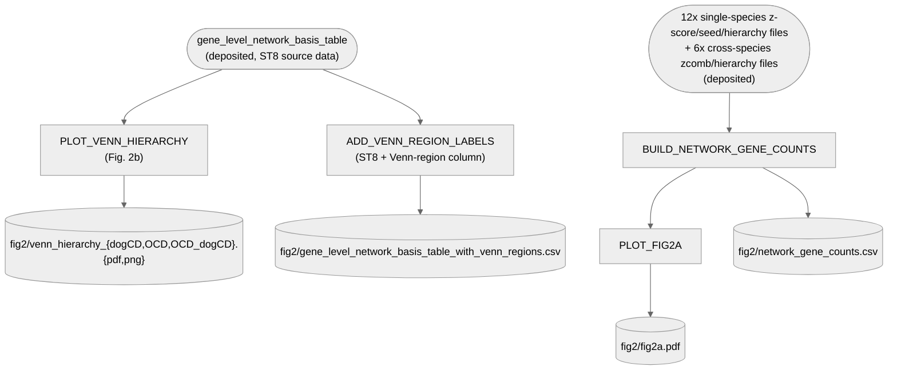

# 05. Network — 4. Plotting (Fig. 2a-b)

Genes captured per network hierarchy (a), and area-proportional Venn diagrams of in_hierarchy
genes — dogCD / OCD / OCD-dogCD each vs. the human-only Depression/Schizophrenia hierarchies (b).

**Pipeline engine:** Nextflow
**Containerized:** Yes (Seqera Wave) — Panel B and Panel A's plot both reuse `go_semantic_plots`
(tidyverse + cowplot already pinned there); Panel A's gene-count step reuses `netcoloc` — no new
builds for any of the three.
**Estimated runtime:** [FILL IN]

Pipeline-converted 2026-09-22 from a loose, manually-run script (`Fig2_network-overlap.R`, no
`pixi` task, hardcoded absolute path) — see Notes below for a real bug found and fixed in the
process. **2026-09-27**: Panel A converted from hardcoded literals to a live computation
(`BUILD_NETWORK_GENE_COUNTS` + `PLOT_FIG2A`) after finding one of the 7 literals was wrong — see
Notes. **2026-10-01**: Panel B replaced — the stacked-bar + Euler diagram is superseded by
area-proportional 3-circle Venn diagrams (`PLOT_VENN_HIERARCHY`), matching KatarinaTe's updated
Fig. 2. The old Panel B process/script moved to
[`archive/fig2b_euler_diagram_superseded/`](../../../archive/fig2b_euler_diagram_superseded).

---

## Pipeline Overview

---

## Input Data

No samplesheet — inputs are direct file params (see
[`nextflow_schema.json`](nextflow_schema.json)).

| Parameter | Description | Source |
|-----------|-------------|--------|
| `ocd_ccd_genes` | Cross-species OCD/dogCD systems-map gene list (also `BUILD_NETWORK_GENE_COUNTS`'s OCD/dogCD hierarchy input) | [`data/05_network/ocd_ccd_systemsmap_genes.txt`](../../../data/05_network/ocd_ccd_systemsmap_genes.txt) — deposited |
| `gene_level_network_basis_table` | Gene-level network/hierarchy membership table (one row per gene, one `in_hierarchy_<Network>` boolean column per network) — the deposited source data for Supplementary Table 8 | [`data/05_network/gene_level_network_basis_table.csv`](../../../data/05_network/gene_level_network_basis_table.csv) — deposited 2026-09-28 |
| `dogcd_z`/`ocd_z`/`dep_z`/`sch_z` | Single-species propagation z-scores, one file per trait | `data/05_network/z_D2_CCD_Oct25_z-scores_pcnet2_251022.csv`, `z_D1_OCD_z-scores_pcnet2_251022.csv`, `z_D1_DEP_z-scores_pcnet2.csv`, `z_D1_SCH_z-scores_pcnet2.csv` — deposited |
| `dogcd_seeds`/`ocd_seeds`/`dep_seeds`/`sch_seeds` | Seed-gene lists, one file per trait (dogCD/OCD have a `gene` header row, Depression/Schizophrenia don't) | `data/05_network/CCDgenes_Oct25.txt`, `OCDgenes_v4.txt`, `human_DEP_noMHC_seed_genes.txt`, `human_schiz_seed_genes.txt` — deposited |
| `dogcd_hier`/`ocd_hier` | Single-species systems-map gene lists for dogCD/OCD | `data/05_network/ccd_systemsmap_genes.txt`, `ocd_systemsmap_genes.txt` — deposited |
| `ocd_ccd_zcomb`/`dep_ccd_zcomb`/`sch_ccd_zcomb` | Cross-species combined z-scores, one file per pairing | `data/05_network/ocd_ccd_zcomb_z12_251022.txt`, `DEP_CCD_Oct25_zcomb_z12.txt`, `SCH_CCD_zcomb_z12.txt` — deposited |
| `dep_ccd_hier`/`sch_ccd_hier` | Cross-species systems-map gene lists for Depression/Schizophrenia pairings | `data/05_network/dep_ccd_systemsmap_genes.txt`, `sch_ccd_systemsmap_genes.txt` — deposited |

---

## Output Data

| Path | Description |
|------|-------------|
| `fig2/venn_hierarchy_dogCD.{pdf,png}` | Fig. 2b input: dogCD vs. Depression/Schizophrenia Venn (not used in the assembled manuscript panel — see Notes) |
| `fig2/venn_hierarchy_OCD.{pdf,png}` | Fig. 2b: OCD vs. Depression/Schizophrenia Venn |
| `fig2/venn_hierarchy_OCD_dogCD.{pdf,png}` | Fig. 2b: OCD/dogCD vs. Depression/Schizophrenia Venn |
| `fig2/network_gene_counts.csv` | Fig. 2a's underlying per-network gene/seed counts, live-computed (see Notes) |
| `fig2/fig2a.pdf` | Fig. 2a: hierarchy-capture bar chart, from `network_gene_counts.csv` (seed segment colour-split by species for cross-species networks — see Notes) |
| `fig2/gene_level_network_basis_table_with_venn_regions.csv` | ST8 source data plus `venn_region_{dogCD,OCD,OCD_dogCD}` — which Fig. 2b Venn region each gene falls into per comparison (see Notes) |
| `pipeline_info/versions.yml` | Per-process tool versions |

---

## Process Map

| # | Process | Description |
|---|---------|-------------|
| 1 | `PLOT_VENN_HIERARCHY` | Fig. 2b — area-proportional Venn diagrams, live from the deposited gene-level hierarchy table |
| 2 | `ADD_VENN_REGION_LABELS` | Adds a human-readable Venn-region column per comparison to ST8's source data (see Notes) |
| 3 | `BUILD_NETWORK_GENE_COUNTS` | Fig. 2a's gene/seed counts for all 7 networks, live-computed from deposited z-score/seed/hierarchy files |
| 4 | `PLOT_FIG2A` | Fig. 2a bar chart, from `BUILD_NETWORK_GENE_COUNTS`'s output |

---

## Notes

**`ADD_VENN_REGION_LABELS` added 2026-10-05** — Katarina asked for a column showing which genes
are shared across the networks the way Fig. 2b's Venns show it, directly in ST8. Reuses
`PLOT_VENN_HIERARCHY`'s own region definitions (same `in_hierarchy_*` columns, same 3 comparisons
against Depression/Schizophrenia) rather than a separate reimplementation, so the new
`venn_region_{dogCD,OCD,OCD_dogCD}` columns (e.g. `"Depression + Schizophrenia"`, `"OCD only"`,
`NA` if a gene isn't in any of that comparison's three in-hierarchy sets) are guaranteed consistent
with the published panels by construction — verified to reproduce the same 7 region counts per
comparison already confirmed against the published figure. Both the deposited
`data/05_network/gene_level_network_basis_table.csv` and `.xlsx` were updated directly (this is
ST8's own source data, not a separate pipeline output) with these 3 columns appended; pre-existing
columns are untouched byte-for-byte — confirmed via diff before committing, since a naive
read/write round-trip through R would otherwise have silently reformatted every existing
`True`/`False` value to `TRUE`/`FALSE`.

**Panel A converted from hardcoded literals to a live computation, 2026-09-27 — one of the 7 was
genuinely wrong.** The old `df_a` literal table (verified 2026-09-18, one row fixed then) held up
for 6 of 7 rows for over a week, but Depression/dogCD's `total` (coded as 387) was actually wrong
under the assumption that all cross-species pairs shared OCD/dogCD's z_comb=3 threshold. Tracing
the real source notebooks (pulled from Pelle:
`code/05_network/2_CrossSpeciesBMI/DEP_CCD_Oct25_NetColoc_analysis_251022.ipynb`) found the true
cause: Depression/dogCD's network was deliberately built at **z_comb=4** (`zthresh=4 # default =
3`, an explicit deviation), not 3. 387 genes is correct, but only at that different threshold — a
naive recount at threshold=3 gives 495. Schizophrenia/dogCD was independently confirmed to
genuinely use threshold=3 (same as OCD/dogCD), via its own sensitivity table
(`data/05_network/netcoloc_enrichment_df_CCD_SCH_251022.csv`). A second, separate error was also
found and fixed: a hand-maintained tracking sheet had "8 dog seeds in network" copied across all
three cross-species rows; the real values are 8 (OCD/dogCD, genuinely correct)/23
(Depression/dogCD)/16 (Schizophrenia/dogCD).

`BUILD_NETWORK_GENE_COUNTS` (`bin/build_network_gene_counts.py`) now recomputes all 7 networks'
gene/seed/hierarchy counts directly from the same deposited z-score, seed-gene, and systems-map
files used throughout `05_network`, with each cross-species pairing's own confirmed threshold
passed explicitly (`--dep-ccd-z-comb-threshold 4`, defaulting the other two to netcoloc's own
default of 3) — so this can't silently go stale the way the hardcoded table did. `PLOT_FIG2A`
(`bin/plot_fig2a.R`) is the same plotting logic as before, just reading this live output instead
of a Google Sheet. See `REPRODUCIBILITY_AUDIT.md`'s 2026-09-27 entries for the full investigation,
including the three real sensitivity-analysis CSVs (`netcoloc_enrichment_df_CCD_{OCD,DEP,SCH}_251022.csv`)
that pin down each pairing's actual threshold.

**Panel A's seed-count segment colour-split and exclusion annotation, added 2026-09-28.** The dark
"seed genes" segment of each bar is now split by species for cross-species networks (dog-derived
seeds in red, human-derived in blue) instead of one flat colour, so it's visible at a glance which
species contributed which seeds to a given cross-species network. A text annotation ("(N not in
hier.)") is also drawn next to any bar with a nonzero count of seed genes excluded from the
hierarchy. Both changes are in `bin/plot_fig2a.R` only — `BUILD_NETWORK_GENE_COUNTS`'s output
columns and the underlying counts are unchanged.

**One remaining small discrepancy, not yet resolved**: for Depression/dogCD specifically, the
deposited `dep_ccd_systemsmap_genes.txt` file gives 23 dog-seed/52 depression-seed genes in the
hierarchy-filtered subnetwork, but KatarinaTe's own Cytoscape session shows 22/51 — a 1-gene
difference on each side. Both the full 387-gene network's seed counts (23 dog/53 depression) and
the total network size are independently confirmed correct; only the hierarchy-subset seed counts
have this small, unresolved 1-gene gap.

**Panel B replaced 2026-10-01 — stacked bar + Euler diagram superseded by proportional circle
Venns.** KatarinaTe dropped in an updated Fig. 2 (`code/07_additional_plots_and_analyses/Figure2_new_panels/`)
using area-proportional 3-circle Venn diagrams instead. The new source script,
`venn_ST8.R` (same folder), was adapted into `bin/plot_venn_hierarchy.R` — geometry/plotting logic
unmodified, only the input changed from a live Google Sheet read (Supplementary Table 8) to the
deposited `gene_level_network_basis_table.csv`, which holds the same gene-level membership data
(checked into the repo 2026-09-28, before this Venn script existed — see
`data/05_network/README.md`'s "GO-term and gene-basis tables" section). Verified the deposited
file reproduces the exact same 7 region counts as the original script's own header comment and the
published Fig. 2b image for all three comparisons (dogCD: 432/517/226/74/16/8/5; OCD:
399/511/290/71/49/14/8; OCD/dogCD: 420/511/106/62/28/14/17). The old Euler-diagram process/script
(`PLOT_NETWORK_OVERLAP` / `plot_network_overlap.R`) moved to
[`archive/fig2b_euler_diagram_superseded/`](../../../archive/fig2b_euler_diagram_superseded) — see
that script's own header for its provenance, including the real "wrong gene list" bug found and
fixed in it 2026-09-22 (it compared the cross-species OCD/dogCD network against the cross-species
Depression/Schizophrenia gene sets instead of the human-only ones the manuscript caption calls
for).

**The published figure only uses two of the three generated Venns** (OCD and OCD/dogCD vs.
Depression/Schizophrenia) — the dogCD Venn is produced for completeness, matching the source
script's own three-comparison design, but isn't part of the manuscript-assembled panel.

**Network layout for the actual Fig. 2b Cytoscape network image** (a separate element of the
manuscript panel, not produced by this process) comes from Cytoscape (see
[`3_Cytoscape`](../3_Cytoscape)), manually configured in Illustrator — confirmed by KatarinaTe (PR
comment, see `data/Manuscript_draft/REVIEW_AND_SUGGESTIONS.md`).

**Fig. 2a/2b are separate output files, not one combined image** — final panel assembly (including
picking which 2 of 3 Venns to use, and combining with the Cytoscape network image) is left as a
manual step (same category as Fig. 1a/1d/3c/5, per other READMEs in this repo).

**A new Fig. 2e (semantic similarity heatmap across enriched GO terms) is not yet implemented
here or anywhere else in the pipeline** — pending KatarinaTe locating the original analysis script
or confirming the permutation/normalization method against the manuscript Results text
("X% of the maximum possible similarity above chance", with permutation P-values). The four
term sets it needs (OCD run1≥5, OCD run2≥5, Depression run1≥5, Schizophrenia run1≥5) were
confirmed to match the panel's stated N's exactly using the archived
`GO_with_without_dogCD.semantic_clustering.top_community.cut60.txt` output, and raw GOSemSim
Wang/BMA similarity between them reproduces the correct ranking of all 6 reported pairs — only the
chance-correction normalization is unresolved.

---

## `GO_TERM_COMPARISON` — moved to `archive/` (2026-09-21)

This directory previously also held a Nextflow-converted `GO_TERM_COMPARISON` workflow (GO-term
enrichment "run1 single-species-only vs. run2 dogCD/CCD cross-species" difference volcano plots).
Confirmed not tied to any figure/table in the current manuscript (not referenced anywhere in root
`README.md`'s Correspondence table) — moved to
[`archive/go_term_comparison_unused/`](../../../archive/go_term_comparison_unused) per
KatarinaTe's request, intended for eventual removal from the repo entirely. Confirmed before
moving that nothing else in the repo depends on it (no other task's `inputs`/`depends-on`
references it, and it read deposited `data/05_network/*.tsv` files directly with no downstream
consumers) — see `REPRODUCIBILITY_AUDIT.md`'s 2026-09-21 update.

---

## Container

`PLOT_VENN_HIERARCHY` (Panel B) reuses `go_semantic_plots`
(`07_additional_plots_and_analyses/4_power_analysis`'s container — tidyverse + cowplot already
pinned there) — no `eulerr` dependency any more, so no dedicated container needed (the old
Euler-diagram Panel B's `network_overlap` container is no longer used here; it's still used by
`2_CrossSpeciesBMI`'s `PLOT_CONSERVED_NETWORK_VENN`, Fig. 1f — see `env/05_network/README.md`).

`BUILD_NETWORK_GENE_COUNTS` reuses `1_NetColoc`'s `netcoloc` container (pandas already pinned
there) — pure data wrangling, no netcoloc-specific functions actually called.

`PLOT_FIG2A` reuses the same `go_semantic_plots` container (tidyverse + cowplot already pinned
there).

See [`env/05_network/README.md`](../../../env/05_network/README.md).
