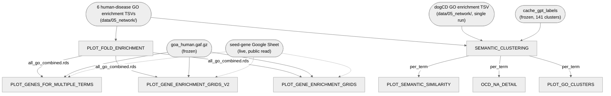

# 05. Network — 5. GO semantic clustering

GO semantic clustering and its downstream figures: the run1 (human-only) vs. run2 (human+dogCD)
GO-enrichment comparison (Fig 2c), the OCD "NA"-term detail plot (Fig 2d), semantic similarity
between networks' enriched GO terms (Fig 2e), the GO fold-enrichment barchart (Fig 3b), and the
per-community gene-enrichment tileplots (Fig 3d/e).

**Pipeline engine:** Nextflow
**Containerized:** Yes (Seqera Wave)
**Estimated runtime:** semantic clustering recomputes a full pairwise GOSemSim similarity matrix
from scratch every run (no cache is checked in) — expect this to be the long pole; the rest is
plotting-scale.

**2026-10-03: `01_semantic_clustering.R` updated to the collaborator's revised script**, adding
dogCD (single-species, dog-only network — one enrichment file, no run1/run2 pair) as a 4th network
alongside DEP/OCD/SCH. This was needed to feed the corrected Fig. 2e semantic-similarity panel
(`PLOT_SEMANTIC_SIMILARITY`, new this same day — see below and Notes), which compares dogCD
against the other four networks. Also adds per-cluster cohesion metrics (mean/min pairwise
similarity, a representative term) and a clustering-cutoff sensitivity scan (silhouette width,
cophenetic correlation across cutoffs 0.4–0.8) — both written to new output columns/files,
described below. One new semantic cluster appears as a result (`cluster_141`, "Positive
regulation of cyclin-dependent kinases" — shared between Schizophrenia and dogCD only; the
previous 140 clusters are unchanged). Verified byte-for-byte reproduction of the collaborator's
own output files against the real deposited data before integrating this. The pre-dogCD script
and GPT-label cache are preserved at
[`archive/go_semantic_clustering_pre_dogcd/`](../../../archive/go_semantic_clustering_pre_dogcd/).

**Same day: Fig. 2e (semantic similarity between networks) built, verified, and wired in as a new
process, `PLOT_SEMANTIC_SIMILARITY`** (`bin/plot_semantic_similarity.R`, not a collaborator
original — built and verified in-session). This replaces an earlier, unverified from-the-manuscript-
text reconstruction (`archive/fig2e_similarity_draft_superseded/`) that got the OCD–Depression
cell wrong because it used GOSemSim's own `combine="BMA"`, which is size-weighted (pools every term
from both sets before averaging) rather than the equal-weighted average of the two directional
means the real method uses — invisible for balanced pairs, but badly wrong for OCD (8 terms) vs.
Depression (129 terms). Verified against the collaborator's real figure legend and her own
intermediate computed values: all 15 pairwise raw-similarity values among DEP/OCD/SCH run1/run2
matched her numbers to 3 decimals, and the chance-corrected score matched within normal
permutation noise. See Notes below for the full method.

7 of the 8 scripts run here are a collaborator's own, under [`bin/`](bin/) — content unmodified;
only their location, execute bit, and (for 4 of them) a prepended `#!/usr/bin/env Rscript` shebang
were added, so they run the same way as every other stage's `bin/` scripts. The 8th,
`plot_semantic_similarity.R` (Fig 2e), is not a collaborator original — see above and Notes.
See `process_definitions.nf`
for how each one is staged and run, and
[`archive/conversion_notes/05_network.md`](../../archive/conversion_notes/05_network.md)
for the reasoning behind every staging/flagging decision. The rest of that collaborator's original
working directory (pre-generated outputs, project/review files) is preserved at
[`archive/go_semantic_clustering_originals/`](../../archive/go_semantic_clustering_originals/); a
separate, unrelated analysis that shared the same directory is at
[`archive/gwas_catalog_enrichment_originals/`](../../archive/gwas_catalog_enrichment_originals/).

---

## Pipeline Overview



---

## Input Data

No samplesheet — inputs are direct file params (see [`nextflow_schema.json`](nextflow_schema.json)).

| Parameter | File | Source |
|-----------|------|--------|
| `dep_only_go` | `DEP_ONLY_hierarchy_full_GO_enrichment.tsv` | `data/05_network/` |
| `dep_ccd_go` | `DEP_CCD_hierachy_full_GO_enrichment.tsv` | `data/05_network/` |
| `ocd_only_go` | `OCD_ONLY_hierachy_full_GO_enrichment.tsv` | `data/05_network/` |
| `ocd_ccd_go` | `Compulsive_hierachy_full_GO_enrichment_251023.tsv` | `data/05_network/` |
| `sch_only_go` | `SCH_ONLY_hierachy_full_GO_enrichment.tsv` | `data/05_network/` |
| `sch_ccd_go` | `SCH_CCD_hierachy_full_GO_enrichment.tsv` | `data/05_network/` |
| `dogcd_go` | `CCD_ONLY_hierachy_full_GO_enrichment.tsv` — single-species, dog-only (no run1/run2 pair) | `data/05_network/` |
| `cache_gpt_labels` | `cache_gpt_labels.top_community.cut60.txt` | `data/05_network/5_GO_semantic_clustering/` (frozen GPT cluster labels, 141 clusters) |
| `goa_human_gaf` | `goa_human.gaf.gz` | `data/05_network/5_GO_semantic_clustering/` (frozen GO Consortium human GAF) |
| `openai_api_key` | — | env var passed to `01_semantic_clustering.R`; see Notes |

The 7 source `.R` scripts themselves are not pipeline params — they run from [`bin/`](bin/), found
via Nextflow's automatic `bin/`-on-`PATH`, same as every other stage.

`PLOT_GENE_ENRICHMENT_GRIDS`, `PLOT_GENE_ENRICHMENT_GRIDS_V2`, and
`PLOT_GENES_FOR_MULTIPLE_TERMS` also read a seed-gene Google Sheet live over the network
(`googlesheets4::read_sheet()` after `gs4_deauth()` — an anonymous, public read, not a pipeline
param).

---

## Output Data

| Path | Description |
|------|-------------|
| `semantic_clustering/GO_clusters_labeled.cut60.txt` | one row per semantic cluster: terms, GPT label, cohesion metrics (mean/min pairwise similarity), representative term |
| `semantic_clustering/GO_with_without_dogCD.semantic_clustering.top_community.cut60.txt` | one row per GO term: run1/run2 signal, community, cluster, GPT label — now 4 `human_disease` values (DEP/OCD/SCH/dogCD) |
| `semantic_clustering/GO_cluster_cutoff_scan.top_community.txt` | clustering-cutoff sensitivity scan (0.4–0.8): cluster/singleton counts, mean silhouette width, cophenetic correlation |
| `go_clusters_plot/GO_run1_vs_run2_by_semantic_cluster.top_community.cut60.sig5.{pdf,png}` | Fig 2c |
| `ocd_na_detail/OCD_NA_detail.top_community.cut60.{pdf,png}` | Fig 2d |
| `semantic_similarity/fig2e_semantic_similarity.{pdf,png}` | Fig 2e |
| `semantic_similarity/fig2e_semantic_similarity_results.csv` | Fig 2e's underlying per-pair values (raw similarity, chance/expected, score, raw and BH-adjusted P) |
| `fold_enrichment/GO_enrichment_OCD_CCD_facets.p5.top10.{pdf,png}` | Fig 3b |
| `fold_enrichment/all_go_combined.rds` | cached combined GO table, built here as a side effect and reused by the 3 processes below |
| `gene_enrichment_grids/OCD_CCD_all_communities_p4_maxts1000_nesting_tileplot.{pdf,_data.csv,_legend.info.txt}` | Fig 3d/e (combined panel) |
| `gene_enrichment_grids/OCD_CCD_community_gene_overlap.tsv` | gene x community overlap, 4-community subset |
| `tileplots_pdfs_and_csvs/OCD_CCD_*_nesting_tileplot.{pdf,_data.csv}` | Fig 3d/e (per-community panels, 7 communities) |
| `tileplots_pdfs_and_csvs/OCD_CCD_community_gene_overlap.tsv` | gene x community overlap, 7-community subset |
| `genes_for_multiple_terms/OCD_CCD_*_nesting_tileplot.{pdf,_data.csv}` | additional per-community panels, 5-community subset — see conversion notes |
| `genes_for_multiple_terms/OCD_CCD_community_gene_overlap.tsv` | gene x community overlap, 5-community subset |

---

## Process Map

| # | Process | Description |
|---|---------|-------------|
| 1 | `SEMANTIC_CLUSTERING` | GOSemSim/Wang semantic clustering of significant GO terms + GPT cluster labeling |
| 2 | `PLOT_GO_CLUSTERS` | run1-vs-run2 scatter plots by semantic cluster, one panel per disease |
| 3 | `OCD_NA_DETAIL` | OCD terms with h+dogCD signal but no human-only signal, by cluster |
| 4 | `PLOT_SEMANTIC_SIMILARITY` | semantic similarity between networks' enriched GO terms, relative to chance |
| 5 | `PLOT_FOLD_ENRICHMENT` | fold-enrichment barchart facetted by community |
| 6 | `PLOT_GENE_ENRICHMENT_GRIDS` | combined gene x GO-term tileplot across 4 communities |
| 7 | `PLOT_GENE_ENRICHMENT_GRIDS_V2` | one tileplot per community, 7 communities |
| 8 | `PLOT_GENES_FOR_MULTIPLE_TERMS` | one tileplot per community, 5 communities |

---

## How to run

```bash
pixi run 05c-go-semantic-clustering
```

or directly:

```bash
cd analyses/05_network/5_GO_semantic_clustering
./run_nextflow.sh
```

Stub test:

```bash
NXF_PROFILE=stub_test ./run_nextflow.sh
```

---

## Notes

- `SEMANTIC_CLUSTERING`'s source script requires `OPENAI_API_KEY` to be a non-empty string
  unconditionally, even when every cluster it needs to label is already covered by the frozen
  `cache_gpt_labels` file. `openai_api_key` defaults to a placeholder value for exactly that case; it
  only needs to be a real key if the semantic-clustering step (recomputed fresh every run — its own
  similarity-matrix cache is not checked in) produces cluster IDs absent from that frozen cache.
- `SEMANTIC_CLUSTERING`'s source script also ends with two unauthenticated
  `googlesheets4::sheet_write()` calls, which are expected to fail non-interactively. All three
  required outputs are written before those calls run, so this process tolerates that specific
  failure rather than treating it as a task failure — see the process's header comment.
- The updated script's 7 input files are read from a hardcoded absolute path baked into the
  collaborator's own unedited code (an old Google Drive mount point on their machine, e.g.
  `/Users/elinor/Library/CloudStorage/.../Volcano_plots/`) rather than the previous version's
  relative `../go_enrichment_tsvs/` path. `SEMANTIC_CLUSTERING` stages the 7 real files there by
  creating that exact absolute directory inside the task and symlinking them in — same
  "stage inputs at the exact path the unmodified script expects" approach as before, just an
  absolute path this time instead of a relative one.
- `01_semantic_clustering.R`'s cutoff-sensitivity scan uses `cluster::silhouette()` — the `cluster`
  package was added to this stage's container spec
  (`env/05_network/5_GO_semantic_clustering/go_semantic_plots.yml`) and the container was rebuilt
  2026-10-03 to include it (tag below). See `env/05_network/README.md` for the rebuild command and
  history.

**`PLOT_SEMANTIC_SIMILARITY` (Fig 2e) method, in detail:**
For each of 5 networks (OCD, OCD/dogCD, dogCD, Depression, Schizophrenia), its enriched-term set is
all GO Biological Process terms at P < 1×10⁻⁵ (`run1`/`run2` ≥ 5) in `SEMANTIC_CLUSTERING`'s
per-term output — N = 8, 75, 8, 129, 116 respectively. For each of the 10 pairs, similarity is the
**equal-weighted average of the two directional best-match means**: for term sets A and B, compute
the full Wang similarity matrix (`GOSemSim::mgoSim(..., combine = NULL)`), take the mean of each of
A's terms' best (max) match in B, separately take the mean of each of B's terms' best match in A,
and average those two numbers. This is deliberately **not** `GOSemSim::mgoSim(..., combine = "BMA")`
— that option pools every term from both sets into one combined mean, which is size-weighted
(dominated by whichever set has more terms) and gives a materially different, wrong answer for
badly size-imbalanced pairs (worked example: OCD vs. Depression — GOSemSim's own BMA gives 0.221,
dominated by Depression's 129-term side; the correct equal-weighted average is 0.558, matching the
collaborator's own value to 3 decimals). The chance-corrected score is
`(observed - expected) / (1 - expected)`, where `expected` is the mean similarity (using the same
equal-weighted formula) over 1,000 permutations drawing random term sets of matching sizes from the
full GO:BP ontology annotated in `org.Hs.eg.db` (12,285 terms with this stage's container,
org.Hs.eg.db 3.22.0; an older local install, org.Hs.eg.db 3.17.0, has 12,588, which shifts four
chance-corrected scores by 0.01 and changes no significance call — the permutation background isn't
specified by the figure legend; this choice reproduces the collaborator's own chance/expected
values within normal permutation noise). The plotted layout matches panel e of the assembled
Figure 2 (rows dogCD, OCD, Depression, Schizophrenia; columns OCD, Depression, Schizophrenia,
OCD/dogCD). Significance asterisks use Benjamini-Hochberg-corrected
empirical P values across all 10 pairs. Verification: all 15 pairwise raw-similarity values among
DEP/OCD/SCH run1/run2 (independent of dogCD) matched the collaborator's own computed values to 3
decimals exactly; the OCD-Depression chance-corrected score matched hers (0.336) within permutation
noise (0.33–0.35 across repeated runs).

---

## Container

One shared container for all 8 processes:
`community.wave.seqera.io/library/go_semantic_plots:69629d5c597a400b`. See
[`env/05_network/README.md`](../../env/05_network/README.md).
