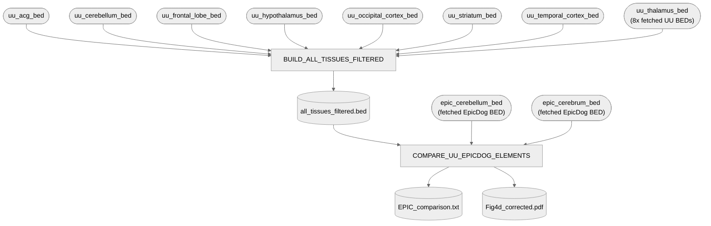

# 06. cCRE — Compare UU vs. EpicDog elements (Fig. 4d)

Element-count comparison of UU's own cCRE atlas vs. EpicDog's, by functional class
(Promoters/Enhancers/Repressed), split into Shared / Unique to EpicDog / Unique to UU.

**Pipeline engine:** Nextflow
**Containerized:** Yes (Seqera Wave — own container, `r-readr`/`r-dplyr`/`r-tidyr`/`r-ggplot2`/
`r-valr`)
**Estimated runtime:** [FILL IN]

Wired into Nextflow 2026-09-22, from the loose `compare_UU_epicdog_elements.R` (a collaborator
draft, left in place untouched at its original top-level location — `bin/compare_UU_epicdog_elements.R`
is the wired copy). Two real bugs found and fixed while validating this for real inside the built
container — see `bin/compare_UU_epicdog_elements.R`'s own header for the full story. Output
confirmed byte-for-byte identical to the already-deposited `data/06_cCRE/EPIC_comparison.txt`.

**2026-09-23**: the UU-side input (`all_tissues_filtered.bed`) is now built live by
`BUILD_ALL_TISSUES_FILTERED` from the 8 fetched per-region UU BEDs, instead of pointing at a
static deposited copy — see Notes below.

---

## Pipeline Overview



---

## Input Data

No samplesheet — inputs are direct file params (see [`nextflow_schema.json`](nextflow_schema.json)).

| Parameter | Description | Source |
|-----------|-------------|--------|
| `epic_cerebellum_bed` | EpicDog 13-state chromatin BED, cerebellum (CanFam4) | Fetched by `analyses/06_cCRE/fetch-epicdog-chromatin-states-bed.sh` |
| `epic_cerebrum_bed` | EpicDog 13-state chromatin BED, cerebrum (CanFam4) | Fetched by `analyses/06_cCRE/fetch-epicdog-chromatin-states-bed.sh` |
| `uu_acg_bed`, `uu_cerebellum_bed`, `uu_frontal_lobe_bed`, `uu_hypothalamus_bed`, `uu_occipital_cortex_bed`, `uu_striatum_bed`, `uu_temporal_cortex_bed`, `uu_thalamus_bed` | UU 9-state chromatin BEDs, one per brain region | Fetched by `analyses/06_cCRE/fetch-chromatin-states-bed.sh` |

---

## Output Data

| Path | Description |
|------|-------------|
| `all_tissues_filtered.bed` | Live-built UU-side comparison input — concatenated, unannotated-state-filtered elements across all 8 brain regions |
| `EPIC_comparison.txt` | Unique_Epic/Unique_UU/Shared element counts per functional class (Promoters/Enhancers/Repressed) |
| `Fig4d_corrected.pdf` | Fig. 4d bar chart |
| `pipeline_info/versions.yml` | Per-process tool versions |

---

## Process Map

| # | Process | Description |
|---|---------|-------------|
| 1 | `BUILD_ALL_TISSUES_FILTERED` | Concatenates the 8 per-region UU BEDs, tags each row with its source region, drops unannotated (state 7) rows |
| 2 | `COMPARE_UU_EPICDOG_ELEMENTS` | Reads both element sets, classifies whole elements as Shared/Unique per functional class, writes the table and bar chart |

---

## Notes

**`all_tissues_filtered.bed` is now built live (2026-09-23), not a static deposited copy.**
`BUILD_ALL_TISSUES_FILTERED` runs `code/06_cCRE/build_all_tissues_filtered.sh`'s wired copy
(`bin/build_all_tissues_filtered.sh`) against the 8 per-region UU BEDs fetched by
`analyses/06_cCRE/fetch-chromatin-states-bed.sh` (pixi task `06e-fetch-chromatin-states-bed`) —
provenance confirmed directly by the manuscript author, 2026-09-21, see that script's own header.
Verified running this for real: the live-built file has 7 fewer lines than the previously-deposited
`data/06_cCRE/all_tissues_filtered.bed` — all 7 are stray leftover `track name=...` header lines in
the deposited copy (an artifact of however its original concatenation was done), confirmed
analytically inert either way since `COMPARE_UU_EPICDOG_ELEMENTS`'s state-filtering already drops
non-numeric-state rows — `EPIC_comparison.txt` output is identical regardless of which copy is
used. `06c-cre-overlap` reads the same 8 per-region BEDs directly for its own UU-side input but
isn't (yet) wired to this same fetch task — a follow-up, not done here.

**Two real bugs found and fixed getting this to actually run**, both in `bin/compare_UU_epicdog_elements.R`'s
header (full detail there):
1. `valr::read_bed()` chokes on these files' UCSC `track name=...` header line — stripped before
   parsing.
2. `valr::read_bed()`'s `n_fields` defaults to 3, so column 4 came back named `X4` instead of
   `name` — every `filter(name %in% ...)` call errored with "object 'name' not found" the first
   time this was actually run for real. Fixed with `n_fields = 9`, confirmed this only changes the
   column header valr assigns, not any values.
3. (Pre-existing fix, kept from the collaborator draft) `bed_subtract(..., any = TRUE)` for
   whole-element unique counts, replacing the default `any = FALSE`'s fragment-counting behavior —
   see the script header for the before/after numbers.

After both new fixes, the script's output (`EPIC_comparison.txt`) matches the already-deposited
`data/06_cCRE/EPIC_comparison.txt` exactly:

```
Feature    Unique_Epic  Unique_UU  Shared
Promoters  10266        23116      25660
Enhancers  87774        53233      50851
Repressed  39365        76817      36651
```

---

## Container

`COMPARE_UU_EPICDOG_ELEMENTS` — new build: `r-base`, `r-readr`, `r-dplyr`, `r-tidyr`, `r-ggplot2`,
`r-valr` — all conda-forge. `compare_UU_epicdog_elements.R`'s `library(tidyverse)` was swapped for
the four specific packages actually used (`readr`, `dplyr`, `tidyr`, `ggplot2`) — this container
installs those directly, not the `tidyverse` meta-package.

`BUILD_ALL_TISSUES_FILTERED` — reuses the `gawk` container already frozen for
`01_mapping/2_cohort_genotyping` (`community.wave.seqera.io/library/gawk:5.3.1--e09efb5dfc4b8156`),
no new build — this process is plain `awk`/bash.

See [`env/06_cCRE/README.md`](../../../env/06_cCRE/README.md).
