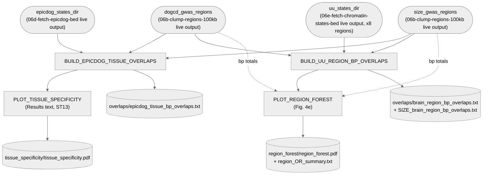

# 06. cCRE — cCRE overlap (Fig. 4e)

GWAS-region overlap with cCREs, two independent analyses sharing the same dogCD/SIZE GWAS-region
inputs: UU per-brain-region overlap (8 regions, Fig. 4e) and EpicDog tissue-specificity (brain vs.
other tissues; reported in the Results text and Supplementary Table 13, no longer a figure panel).

**2026-10-06**: Fig. 4 (`Figure4_261006`) now shows only the per-region odds-ratio plot, as panel
e (it was panel f). The tissue-specificity plot was dropped from the figure; its process is kept
because its odds ratios are still reported. Outputs renamed without panel letters, so future
relettering needs no code change: `fig4f/fig4f_*` → `region_forest/region_*`, and
`fig4e/fig4e_tissue_specificity.pdf` → `tissue_specificity/tissue_specificity.pdf`.

**Pipeline engine:** Nextflow
**Containerized:** Yes (Seqera Wave) — reuses two containers already frozen for this stage's
other substages: `clump_regions` (bedtools) and `emission_state` (ggplot2/dplyr), no new build.
**Estimated runtime:** [FILL IN]

Converted 2026-09-21 from `testing_CRE_overlap_260617.R`, a 1179-line, largely exploratory script
with many superseded duplicate sections. Only the two analyses the manuscript reports are reproduced
here — both as single odds-ratio forest plots (confirmed against the then-embedded figure in
`NATURE_Main_Figures.docx`), not the source script's own multi-panel rates/size figures. See each `bin/*.R` script's header for the
full conversion story and Notes below for what was dropped.

**2026-09-23**: GWAS-region inputs wired to `06b-clump-regions-100kb`'s live output — was
deposited reference copies before. See Notes below, including an important caveat about `06b`'s
`dogCD` scope changing the same day.

**2026-09-24**: `06c-cre-overlap`'s `depends-on` now also includes `06d-fetch-epicdog-bed` and
`06e-fetch-chromatin-states-bed` — both chromatin-state inputs were already read from the right
paths, but nothing previously guaranteed those fetch tasks ran first. Now fully dependency-enforced,
not just path-correct by coincidence.

---

## Pipeline Overview

---

## Input Data

No samplesheet — inputs are direct file/directory params (see
[`nextflow_schema.json`](nextflow_schema.json)).

| Parameter | Description | Source |
|-----------|-------------|--------|
| `epicdog_states_dir` | Per-tissue EpicDog 13-state chromatin BEDs (CanFam4) | `06d-fetch-epicdog-bed`'s live output (`analyses/06_cCRE/fetch-epicdog-chromatin-states-bed.sh`) |
| `uu_states_dir` | Per-region UU 9-state chromatin BEDs, 8 dog brain regions | `06e-fetch-chromatin-states-bed`'s live output ([`data/06_cCRE/chromatin_states_bed/`](../../../data/06_cCRE/chromatin_states_bed)) |
| `dogcd_gwas_regions` | dogCD GWS clump regions ±100kb, pooled across all 17 dogCD-related GWAS traits | `06b-clump-regions-100kb`'s live output (`gws100kb_regions/dogCD_gws100kb_regions.bed`) — see Notes below |
| `size_gwas_regions` | SIZE GWS clump regions ±100kb | `06b-clump-regions-100kb`'s live output (`gws100kb_regions/SIZE_gws100kb_regions.bed`) |

---

## Output Data

| Path | Description |
|------|-------------|
| `overlaps/epicdog_tissue_bp_overlaps.txt` | bp-level overlap of dogCD/SIZE GWAS regions with EpicDog brain vs. other-tissue cCREs |
| `tissue_specificity/tissue_specificity.pdf` | Odds ratio (Brain vs. other tissues), dogCD and dogSize — values reported in the Results text and ST13; not a figure panel |
| `overlaps/brain_region_bp_overlaps.txt`, `overlaps/SIZE_brain_region_bp_overlaps.txt` | bp-level overlap of dogCD/SIZE GWAS regions with each of the 8 UU brain-region cCRE sets |
| `region_forest/region_forest.pdf` | Fig. 4e: odds ratio (dogCD vs. dogSize) per UU brain region, ACG highlighted |
| `region_forest/region_OR_summary.txt` | Per-region OR/CI table + a plain-text range sentence (min/max region with CIs), for the manuscript Results text |
| `pipeline_info/versions.yml` | Per-process tool versions |

---

## Process Map

| # | Process | Description |
|---|---------|-------------|
| 1 | `BUILD_EPICDOG_TISSUE_OVERLAPS` | bp overlap of GWAS regions with pooled brain (cerebellum+cerebrum) vs. pooled other (9 tissues) EpicDog active elements |
| 2 | `PLOT_TISSUE_SPECIFICITY` | Tissue-specificity forest plot (Results text, ST13) — Fisher's exact test, dogCD and dogSize |
| 3 | `BUILD_UU_REGION_BP_OVERLAPS` | bp overlap of GWAS regions with each of 8 UU brain-region active-element sets |
| 4 | `PLOT_REGION_FOREST` | Fig. 4e forest plot — per-region Fisher's exact test, dogCD vs. dogSize |

---

## Notes

**No pooled/meta-analytic OR across the 8 regions (2026-09-24).** The manuscript's Results text
cites a Mantel-Haenszel pooled OR across regions; that computation exists in the original source
script (`archive/testing_CRE_overlap_superseded/testing_CRE_overlap_260617.R`, lines ~870-923) but
was itself an earlier, unrelated Claude suggestion rather than an established/validated method —
and it pools using a single shared `dogCDbp`/`Size_bp` scalar as every stratum's denominator,
which is a real structural mismatch with Mantel-Haenszel's usual independent-strata assumption. A
meta-analytic alternative (inverse-variance pooling of the 8 per-region log-ORs) was also
considered. KatarinaTe opted to drop the pooled figure entirely and just report the 8 per-region
Fisher's ORs already in the plot — `plot_region_forest.R` now also writes
`region_OR_summary.txt` (the full per-region table plus a plain-text range sentence with
CIs) so this is a tracked pipeline output, not something read off the plot by eye.

**GWAS-region inputs are now `06b-clump-regions-100kb`'s live output (2026-09-23), not deposited
reference copies.** `pixi.toml`'s `06c-cre-overlap` task now has a real
`depends-on = ["06b-clump-regions-100kb"]`.

**This is not a like-for-like swap against the old deposited files, and that's now fully
validated, not just expected.** The same day this was wired in, `06b` was also extended to (1)
pool POLMM's 14 item traits into its `dogCD` region set (previously just the 3 mlma-loco factor
traits) and (2) add a genome-wide significance filter (`P < 4e-7`) that the old manual process
applied by hand but the automated pipeline was missing — see `clump_regions_100kb/README.md`'s
Notes for both. KatarinaTe tested the corrected pipeline directly against real historical GWAS
output on Pelle: `dogCD`'s live output now reproduces the deposited `dogCD_gws100kb_collapsed.bed`
exactly (0 bp missing) plus exactly the new coverage the POLMM-pooling scope change should add
(two new 200kb regions). `SIZE` reproduces its deposited reference to within a small residual
(~359kb of boundary differences, traced to a manual transcription slip in the old deposited file
itself, not a pipeline issue — see `REPRODUCIBILITY_AUDIT.md`'s 2026-09-23 updates for the full
investigation). The live pipeline output is now the verified, trustworthy source — the deposited
files are the ones that had the (small, now-understood) error, not the other way around.

`verify_gwas_regions_against_deposited.sh` (one-off tool, not part of the DAG) still works as a
sanity check, but expect it to show the `dogCD` scope difference above (real and expected) and a
small `SIZE` residual (also now explained).

**What was dropped from the source script.** `testing_CRE_overlap_260617.R` is ~1179 lines; most
of it is superseded exploratory work, not part of either published figure:
- ~350 lines of hand-typed, hardcoded element-count/bp-count contingency tables (an earlier,
  pre-`epicdog_tissue_bp_overlaps.txt` draft of the tissue-specificity analysis).
- A global chi-square + per-region "one vs. rest" Fisher/FDR side-analysis on the UU data
  (not part of either figure; superseded by the direct dogCD-vs-dogSize per-region comparison
  `PLOT_REGION_FOREST` reproduces).
- Three near-duplicate rewrites of the tissue-specificity figure and three more of the
  region figure, each a two- or three-panel combination (rates + odds ratio, or size +
  rates + odds ratio). Checked against the actual embedded figure in `NATURE_Main_Figures.docx`:
  both published panels are just the single odds-ratio forest plot, so only that computation and
  panel are reproduced in `bin/plot_tissue_specificity.R`/`bin/plot_region_forest.R` — the rate
  and cCRE-size panels the source script also built are not part of the manuscript.

**The tissue-specificity odds ratios use the mammary-gland-bug-fixed numbers, which no longer match the manuscript's
currently-embedded figure.** `check_CRE_overlap.sh`'s original tissue-pooling `cat` step silently
dropped mammary-gland tissue from the "other" pool (a `mammary_gland`/`mammary` filename
mismatch); `check_epicdog_bp_overlap.sh` fixed this and `epicdog_tissue_bp_overlaps.txt` reflects
the corrected numbers rather than the original bug's (OR 1.15/
0.85, still what's in the manuscript's embedded image as of this writing). Confirmed directly with
KatarinaTe (2026-09-21): the fix is correct and she has already produced an updated version of
this panel elsewhere — this pipeline should use, and does use, the corrected numbers. With the final GWAS regions
(`06b-clump-regions-100kb`'s live output, 2026-09-23 run) these give dogCD OR 1.061 (95% CI
1.058–1.064) and dog size OR 0.845 (0.842–0.847) — exactly the values in Supplementary Table 13
and the Results text. (An earlier 2026-09-17 table built from pre-final regions gave 1.08/0.87;
it's archived in `archive/cCRE_overlap_tables_superseded/`.)

**`BUILD_UU_REGION_BP_OVERLAPS` (`bin/check_uu_region_bp_overlap.sh`) replaces two things.**
`SIZE_check_UU_CRE_overlap.sh` (SIZE only, hardcoded absolute UPPMAX paths, depended on per-region
`*_UU_CRE_active_elements.bed` files from a commented-out, never-run generation loop) and a
dogCD-side equivalent that was never committed at all — `brain_region_bp_overlaps.txt` (dogCD)
had been a deposited-only result up to now. The new script computes both directly from
`data/06_cCRE/chromatin_states_bed/*_9_dense.bed`, using the same active-state definition
`SIZE_check_UU_CRE_overlap.sh`'s own commented-out filtering step specified (every state except 7
"no signal" and 9 "repressed"). Verified 2026-09-21: reproduces the previously-deposited
`brain_region_bp_overlaps.txt`/`SIZE_brain_region_bp_overlaps.txt` exactly, region-for-region —
this analysis has no tissue-pooling step, so there's no equivalent of the mammary-gland bug to
find here.

---

## Container

Reuses both of this stage's existing containers, no new build:
- `BUILD_EPICDOG_TISSUE_OVERLAPS`/`BUILD_UU_REGION_BP_OVERLAPS`: `clump_regions` (bedtools +
  base-R).
- `PLOT_TISSUE_SPECIFICITY`/`PLOT_REGION_FOREST`: `emission_state` (ggplot2/dplyr already
  pinned there).

See [`env/06_cCRE/README.md`](../../../env/06_cCRE/README.md).
