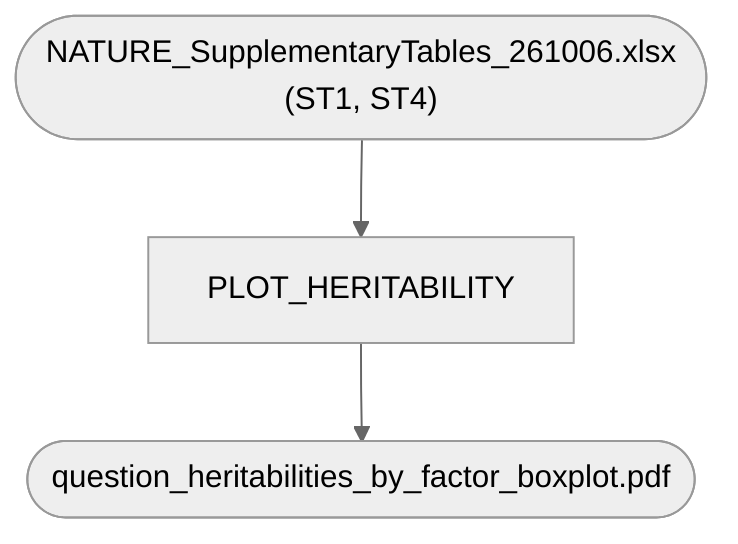

# 07. Additional plots and analyses — 1. Heritability plot

Fig 1b: per-question heritability boxplot, grouped by the 3 dogCD factors, read directly from the
published Supplementary Tables (`ST1` for the survey-question key, `ST4` for the heritability
values) — no live Google Sheet dependency. Includes the two human OCD SNP-heritability reference
lines (ref. 1; dashed line ± SE band): all ascertainment types 6.7% ± 0.3%, clinical ascertainment
16.4% ± 1.5% — hardcoded at the top of the script (`human_h2`), since they come from the
literature, not from this study's data.

**Pipeline engine:** Nextflow
**Containerized:** Yes (Seqera Wave — shared with `2_gwas_catalog_overlap` and `04_gwas/5_plotting`)
**Estimated runtime:** [FILL IN]

---

## Pipeline Overview

The heritability calculation itself lives in `github.com/VistaSohrab/dog-gwas-heritability-nextflow`
(a different repository, per the manuscript's own Code Availability) — this stage only plots its
published result (`ST4`), same citation chain as documented in `REVIEW_AND_SUGGESTIONS.md`'s Fig 1b
entry.

## Inputs

| Param | Description |
|---|---|
| `supp_tables_xlsx` | `NATURE_SupplementaryTables_261006.xlsx` (`data/Manuscript_draft/`) |

## Outputs

`question_heritabilities_by_factor_boxplot.pdf`, published under `heritability_plot/`.

## Container

`gwas_supplement_plots` (`r-base`, `r-tidyverse`, `r-data.table`, `r-readxl`, `r-ggrepel`,
`r-qqman`) — shared with `2_gwas_catalog_overlap` and `04_gwas/5_plotting`. See
`env/shared/README.md` for the build story.

## Notes

**Real schema-drift bug found and fixed 2026-09-22.** The script's join against `ST1` (survey-
question key) expected a column literally named `Factor`; the current `NATURE_SupplementaryTables.xlsx`
has it as `Highest loading factor` instead (renamed at some point after this script was last
verified against real data). The join was silently producing no `Factor` column at all, breaking
the script outright (`recode()` error on a `NULL` column) rather than plotting a wrong value —
fixed by referencing the current column name directly.

Re-ran the corrected script against the current, real Supplementary Tables end-to-end: the 3
factor-level star markers land at **0.28254** (Factor 1), **0.09442** (Factor 2 — `ST4`'s own
`GREML LDS constrained heritability` is `NA` for Factor 2, so this substitutes the LD-corrected
*unconstrained* value instead, same substitution the script already made before this fix), and
**0.20528** (Factor 3). The current manuscript caption states 0.27 / 0.08 / 0.21 for these three —
Factor 3 matches (0.21 rounded); Factors 1 and 2 don't (0.28 vs 0.27, and 0.09 vs 0.08 — the
caption's "0.08" matches `ST4`'s *non*-LD-stratified unconstrained value, 0.08399, not the
LD-stratified one this script plots). Not changed here — this is a manuscript-text question,
not a code bug, flagged for KatarinaTe to decide which number the caption should cite.

**Restyled to match the published Fig 1b layout, 2026-10-06** (`Figure1_261006.pdf`): single
colour for all three factors, x labels `Factor 1/2/3`, the two most heritable factor-3 items
(145 false digging, 146 tail chasing) labeled, and the two human reference lines/bands added.
Plotted values are unchanged.
