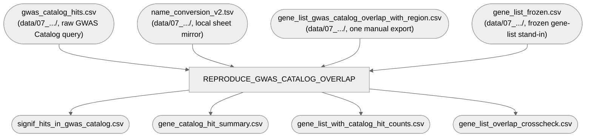

# 07. Additional plots and analyses — 2. GWAS-catalog overlap

Reproduces the mechanical half of the "12 of 27 dogCD GWAS regions overlap a GWAS-catalog
psychiatric gene" claim: per-gene psychiatric/OCD/temperament hit-count join, from local
repo-tracked inputs only — no live Google Sheets access needed.

**Pipeline engine:** Nextflow
**Containerized:** Yes (Seqera Wave — shared with `1_heritability_plot` and `04_gwas/5_plotting`)
**Estimated runtime:** [FILL IN]

---

## Pipeline Overview

The original scripts' `gene_list` came from a "gene list" Google Sheet tab (region assignment,
network-community membership, a hand-assigned "rating", free-text "comment") with no file
equivalent anywhere in this repo and no generating script — see `bin/reproduce_gwas_catalog_overlap.R`'s
own header for the full provenance story of `gene_list_frozen.csv` as a best-effort stand-in.
The `rating`/community-membership/`comment` content of that frozen file remains a manually
curated input that needs a human to refresh if the live sheet ever changes — same category as
Axiom genotype calling (see `REPRODUCIBILITY_AUDIT.md`).

## Inputs

| Param | Description |
|---|---|
| `catalog_hits_file` | Raw GWAS Catalog query results (`data/07_additional_plots_and_analyses/gwas_catalog_hits.csv`) |
| `name_conversion_file` | Local mirror of the "name conversion" sheet (`.../name_conversion_v2.tsv`) |
| `frozen_overlap_file` | The one manual merged-result export, used only for the crosscheck output (`.../gene_list_gwas_catalog_overlap_with_region.csv`) |
| `frozen_gene_list_file` | Frozen master gene list (`.../gene_list_frozen.csv`) |

All 4 inputs live in `data/07_additional_plots_and_analyses/` — moved out of
`archive/gwas_catalog_enrichment_originals/` (2026-09-21), since they're real pipeline inputs, not
provenance-only material that can be lost when `archive/` is deleted before publication. The rest
of that collaborator's original working directory (the raw per-gene `gwas_cache/`, exploratory
scripts, superseded labeling CSVs) stays in `archive/`.

## Outputs

4 CSVs, published under `gwas_catalog_overlap/`: `signif_hits_in_gwas_catalog.csv`,
`gene_catalog_hit_summary.csv`, `gene_list_with_catalog_hit_counts.csv`,
`gene_list_overlap_crosscheck.csv` (a self-consistency check against the frozen file, not
independent validation — see the script header).

## Container

`gwas_supplement_plots` (`r-base`, `r-tidyverse`, `r-data.table`, `r-readxl`, `r-ggrepel`,
`r-qqman`) — shared with `1_heritability_plot` and `04_gwas/5_plotting`. See
`env/shared/README.md` for the build story.
