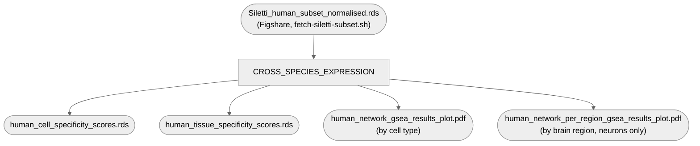

# 07. Additional plots and analyses — 3. Cross-species expression

Fig 4a-b: dogCD/OCD network gene-set enrichment (UCell + fgsea) against the Siletti et al. 2023
human brain snRNA-seq atlas, by cell type and by brain region (neurons only).

**Pipeline engine:** Nextflow
**Containerized:** Yes (Seqera Wave — Seurat/fgsea/UCell, own container)
**Estimated runtime:** [FILL IN]

---

## Pipeline Overview

`network_gene_expression_enrichment_plots_code_updated.r` (the collaborator's own script,
`code/07_additional_plots_and_analyses/`) stays in place untouched — `bin/cross_species_expression.R`
is a literal reproduction, only the `readRDS()` path replaced with a CLI arg, plus explicit
`saveRDS()`/`ggsave()` calls for the 2 derived matrices and 2 plots the original built in-memory
but never wrote to disk (needed for Nextflow to capture real outputs — no other logic changed).
**One exception, 2026-09-22**: dropped `library(ComplexHeatmap)`/`library(circlize)` — loaded in
the original but never actually called anywhere in this script (the Spearman-correlation heatmap
they'd be for is a separate analysis, **Extended Data Fig. 3** — now converted, verified exactly
against the published figure, and Nextflow-wired as its own stage, see
[`5_cross_species_transcriptomic_heatmap/`](../5_cross_species_transcriptomic_heatmap)).

**Data-availability note, per the manuscript author directly:** `Siletti_human_subset_normalised.rds`
is a subset of the full Siletti et al. 2023 atlas, deposited on Figshare
(`10.6084/m9.figshare.33787129`). The script that produced this subset from the full atlas
**cannot be provided** ("we can not provide the scripts that generates the subset") — reproducibility
stops at this deposited `.rds`, cited back to Siletti et al. 2023 as the primary data source. This
is an accepted limitation, not a gap to close further. See `REPRODUCIBILITY_AUDIT.md`.

## Inputs

| Param | Description |
|---|---|
| `siletti_rds` | `Siletti_human_subset_normalised.rds` (`data/07_additional_plots_and_analyses/`, fetched by `fetch-siletti-subset.sh` — pixi task `07c-fetch-siletti-subset`, pulled in automatically via `07d-cross-species-expression`'s `depends-on`) |

## Outputs

`human_cell_specificity_scores.rds`, `human_tissue_specificity_scores.rds`,
`human_network_gsea_results_plot.pdf`, `human_network_per_region_gsea_results_plot.pdf` —
published under `cross_species_expression/`.

## Container

`cross_species_expression` (`r-base`, `r-seurat`, `r-dplyr`, `bioconductor-fgsea`,
`bioconductor-ucell`, `bioconductor-complexheatmap`, `r-circlize`). The one genuinely fragile
container in this batch (Seurat's dependency tree) — see `env/07_additional_plots_and_analyses/3_cross_species_expression/README.md`
for the build story. `bioconductor-complexheatmap`/`r-circlize` are still installed in the
already-built image (not rebuilt after the script stopped importing them 2026-09-22) — harmless,
just unused weight; drop them from the `.yml` and rebuild if that's ever worth doing.
