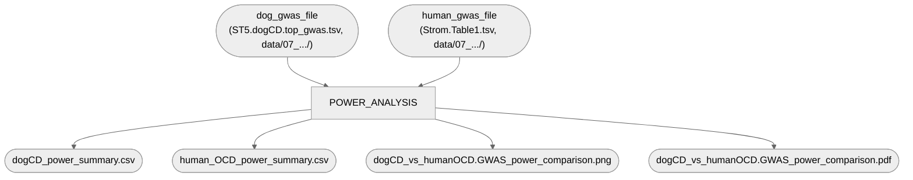

# 07. Additional plots and analyses — 4. Power analysis (Fig 1d)

Statistical power comparison, dogCD GWAS vs. human OCD GWAS (Strom et al. 2025 meta-analysis):
dogCD achieves power comparable to human OCD despite a far smaller sample size, because canine
breed structure inflates per-locus variance explained.

**Pipeline engine:** Nextflow
**Containerized:** Yes (Seqera Wave) — reuses `go_semantic_plots` (`05_network/5_GO_semantic_clustering`'s
container: `r-tidyverse` + `r-cowplot`, both this script needs), no new build.
**Estimated runtime:** [FILL IN]

Converted 2026-09-24 from a self-contained bundle (`power_calcs.dog_v_human_GWAS.R` + 2 input
TSVs + pre-computed outputs + a figure-legend/methods docx) provided under
`data/Elinor_simple_power_analysis/`. Only change from the original script: the two hardcoded
input filenames became CLI args — no other logic touched. Original bundle preserved at
`archive/elinor_power_analysis_originals/` for provenance, and used to verify this conversion
reproduces its outputs exactly (see Notes below).

---

## Pipeline Overview

## Inputs

| Param | Description |
|---|---|
| `dog_gwas_file` | DogCD top GWAS hits per clumped region, all 17 traits (`data/07_additional_plots_and_analyses/ST5.dogCD.top_gwas.tsv`) |
| `human_gwas_file` | Human OCD GWAS genome-wide-significant loci, Strom et al. 2025 Table 1 (`data/07_additional_plots_and_analyses/Strom.Table1.tsv`) |

Both frozen/deposited — not built by any pipeline in this repo, same category as `2_gwas_catalog_overlap`'s inputs.

## Outputs

Published under `power_analysis/`:

| File | Description |
|---|---|
| `dogCD_power_summary.csv` | Per-locus R², power at the observed p-value, and R² needed for 80% power, for every dogCD clumped region across all 17 traits |
| `human_OCD_power_summary.csv` | Same, per human OCD genome-wide-significant locus |
| `dogCD_vs_humanOCD.GWAS_power_comparison.png`/`.pdf` | The figure: one representative dogCD power curve (minimum trait N) + one human OCD power curve, with genome-wide-significant loci overlaid as points |

## Container

`go_semantic_plots` (`r-base`, `r-tidyverse`, `r-cowplot`, + others unused here) — same container
already frozen for `05_network/5_GO_semantic_clustering`, reused because it's the only existing
container with both `tidyverse` and `cowplot`. See `env/05_network/README.md` for the build story.

---

## Notes

**Verified against the originally provided outputs, twice (2026-09-24).** Ran the converted
script both locally (against the same two input TSVs) and for real through the Nextflow workflow
on Pelle (`pixi run 07e-power-analysis`, real Apptainer container, real SLURM job — not a stub
test), diffing both against the pre-computed versions in `archive/elinor_power_analysis_originals/`.
In both runs, every column matches exactly except `r2` and `power_at_hit` (derived from `r2`),
which differ by at most 6.1e-16 (machine epsilon — floating-point noise from a different R/BLAS
build per environment, not a real numeric difference). The locally-run PNG is byte-identical
(`md5`) to the original; the Pelle-container PNG differs in raw bytes (different
libpng/Cairo build) but is the same plot from the same data. The CLI-args change is the only real
diff from the original script.

**Figure legend** (from the original bundle's docx, reproduced here since the docx itself isn't
kept in the repo): *"DogCD GWAS achieve power comparable to human OCD GWAS despite far smaller
sample sizes. Power to detect a locus explaining a given percentage of phenotypic variance, for
dogCD (red; N = 2,322; P ≤ 4×10⁻⁷) and human OCD (grey; effective N = 209,150; P ≤ 5×10⁻⁸). Points
indicate genome-wide significant loci."*

**Methods** (same source): *"Statistical power comparison between dogCD and human OCD GWAS. To
place the dogCD and human OCD discoveries on a common power scale, we first converted the human
case-control design (53,660 cases, 2,044,417 controls) into an effective sample size to account
for the unbalanced case:control ratio: Neff = 4 / (1/Ncases + 1/Ncontrols). For each locus, we
estimated the phenotypic variance explained (R²) from its reported p-value as R² = χ²/(χ²+N),
where χ² = qchisq(1−p, df = 1); this test-statistic-based estimate does not assume a particular
effect-size scale, so it applies equally to dogCD's continuous and ordinal traits and to human
OCD's case-control design, using Neff in place of N for the latter. Power to reach each study's
discovery threshold (P ≤ 4×10⁻⁷ for dogCD; P ≤ 5×10⁻⁸ for human OCD) was then computed from the
non-central chi-squared distribution (1 d.f.) as a function of sample size and R², using each
dogCD trait's own sample size for its lead loci and the minimum trait sample size (N = 2,322) for
the representative power curve shown in the figure. All analyses were performed in R using the
tidyverse package."*

**`ST5.dogCD.top_gwas.tsv` is a frozen table, not live pipeline output.** It's Supplementary
Table 5's own content (per-region clumped top hits across all 17 dogCD traits, mlma-loco +
POLMM), provided as-is rather than derived from this repo's `06b-clump-regions-100kb` or any
other substage. If the manuscript's GWAS results are later revised (e.g. as `04a-mlma-loco`/
`04b-polmm` run for real through the corrected pipeline), this table would need refreshing by
hand — same category as `2_gwas_catalog_overlap`'s frozen gene list.
